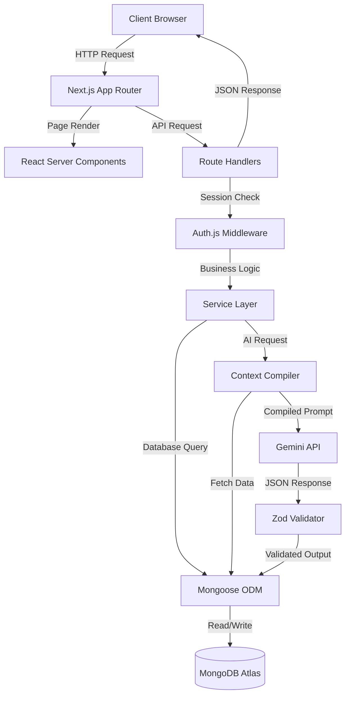
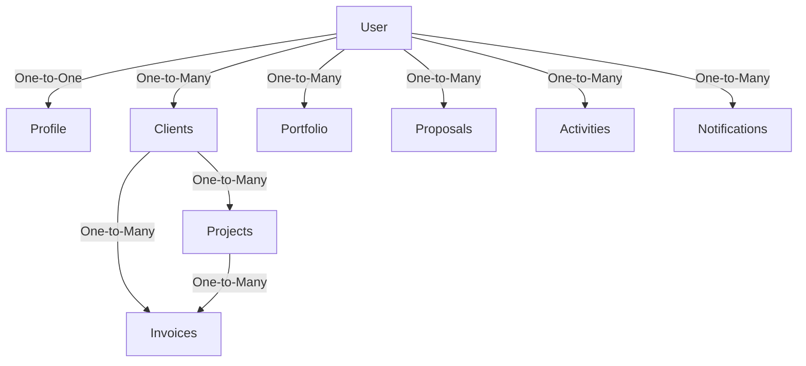
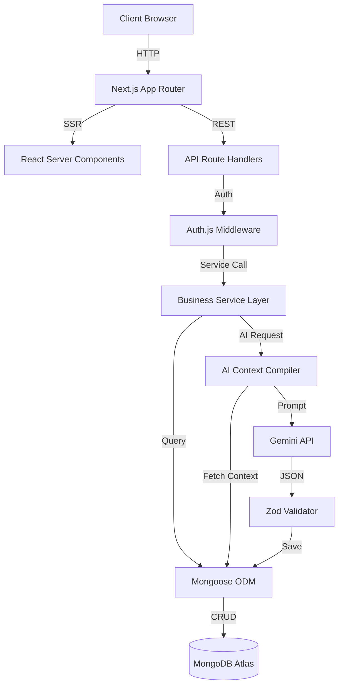
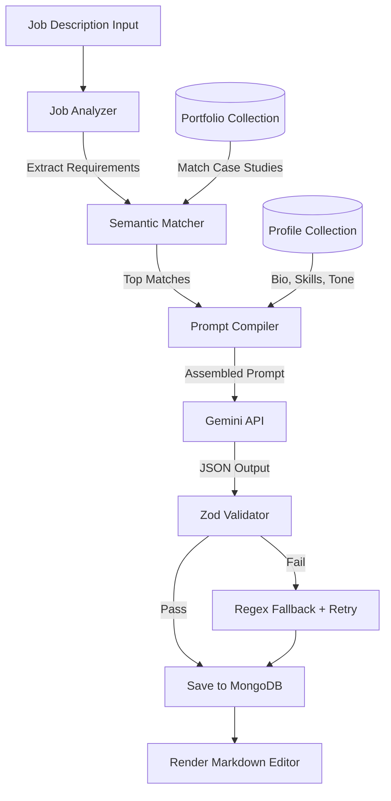
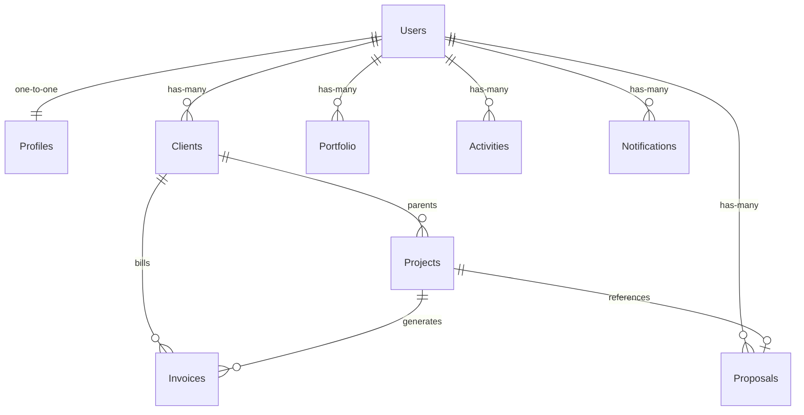
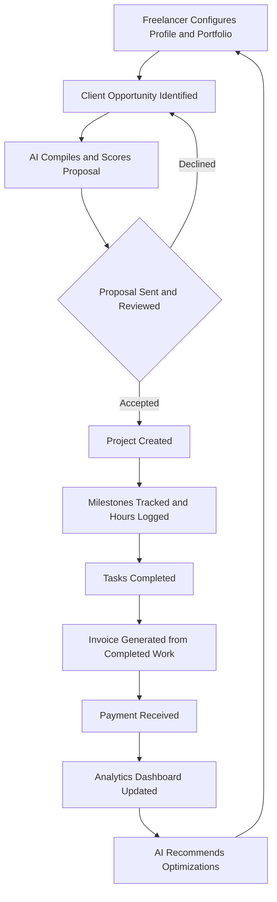

# AI_CONTEXT.md — FreelAI

> **Purpose:** This is the primary context document for every AI assistant working on the FreelAI codebase. Read this file in full before making any changes, answering questions, or generating code related to FreelAI.

> **Last Updated:** 2026-07-11

---

## 1. Project Overview

### What is FreelAI?

FreelAI is an AI-powered Software-as-a-Service (SaaS) platform designed as a unified operating workspace for freelancers, independent professionals, and small agencies. It serves as a central hub that automates administrative tasks, simplifies business workflows, and optimizes client relationships.

### Why Was It Built?

Freelancers operate as solo businesses — they must simultaneously act as sales representatives, project managers, accountants, and service providers. This administrative overhead reduces billable hours, slows growth, and causes burnout. FreelAI exists to eliminate this overhead by consolidating fragmented tools into a single, AI-native workspace.

### Core Problems Solved

| Problem | How FreelAI Solves It |
|:---|:---|
| **Fragmented Tooling** | Replaces separate apps for CRM, invoicing, project tracking, and proposal generation with a unified workspace. |
| **Manual Pitching** | AI Proposal Generator leverages portfolio and profile data to produce tailored pitches in seconds. |
| **Untracked Follow-ups** | Automated reminders and AI-guided scheduling for invoices and client communications. |
| **Lack of Business Insights** | Analytics dashboard visualizes revenue forecasting, client value, and operational efficiency. |

### Who Is It For?

- Developers and technical consultants
- Designers (UI/UX, motion, video)
- Copywriters and marketers
- Agencies and multi-disciplinary consultants

### Core Value Proposition

FreelAI is **AI-first** — the artificial intelligence is not an optional add-on. It is the core engine linking data across modules. Portfolio data feeds the AI proposal generator, which connects to project management scope, which flows into invoicing terms and analytics.

---

## 2. Vision

FreelAI is building the **AI Business Operating System (BOS)** for freelancers.

It is **not** just an AI Proposal Generator. It is the central workspace where freelancers run their entire business.

### Long-Term Direction

The platform is evolving from reactive tools (requiring the freelancer to input and prompt) toward **proactive AI agents** that autonomously:

- Monitor project timelines and flag risks
- Analyze client sentiment and relationship health
- Predict cash flow shortages
- Suggest rate optimization strategies
- Draft follow-up emails and client communications
- Scan job boards for matching opportunities

The end state is a system where the AI manages the business operations while the freelancer focuses on their craft.

---

## 3. Product Philosophy

These principles guide every product decision in FreelAI:

1. **AI-First, Not AI-Also:** Every feature is designed with AI capabilities natively integrated into the data schema.
2. **Minimalism and Speed:** High-performance interfaces with clean structures and no clutter. Built with shadcn/ui and Tailwind CSS.
3. **Context Awareness:** The system uses existing portfolio, CRM, and task logs to generate precise context for LLM prompts. No manual copy-pasting.
4. **Professionalism and Trust:** All generated output (proposals, invoices, emails) must match the caliber of top-tier consulting firms.
5. **Automation Over Configuration:** The software works for the user, automates repetitive steps, and offers sensible defaults.
6. **Reusable and Scalable:** Components, services, and patterns are designed for reuse. Features are modular and independently extensible.
7. **Business-Focused:** Every feature must directly reduce administrative overhead or increase revenue potential.

---

## 4. Core Features

### Landing Page
- **Purpose:** Marketing gateway and customer acquisition page.
- **Functionality:** Hero section with value proposition, interactive AI demo preview, pricing matrix (Free/Pro/Agency tiers), FAQ accordion.
- **AI Involvement:** Pre-computed mock AI generations showing visitors how proposals are compiled.

### Authentication
- **Purpose:** Secure access control and session management.
- **Functionality:** Credentials signup (email/password), OAuth login (Google/GitHub), protected routing via middleware, session management via cookies.
- **AI Involvement:** None. Pure security module.

### Dashboard (Mission Control)
- **Purpose:** Authenticated homepage providing a consolidated real-time business snapshot.
- **Functionality:** KPI metrics cards (revenue, payment velocity, active proposals), active projects table, client health indicators, quick action drawer, activity feed.
- **AI Involvement:** Daily Briefing compiler summarizes tasks, unpaid bills, and schedules. AI Copilot widget renders proactive recommendation cards.

### Client CRM
- **Purpose:** Track and organize professional client network, analyze account value, flag relationship risks.
- **Functionality:** Client directory with search/filter/sort, client creator form, relationship health evaluator (Good/Fair/At Risk), lifetime value tracker, detailed client workspace with timeline, pinned notes, and AI intelligence block.
- **AI Involvement:** Background analysis evaluating relationship health based on invoice payment velocity and communication frequency.

### Project Management
- **Purpose:** Define project scopes, track tasks, log progress, flag timeline bottlenecks.
- **Functionality:** Project directory (grid view), milestone tracker with progress bars, budget meter (hours vs budget), status flags (Planning/Design/Development/Review/Done), Kanban task board, time sheet logging.
- **AI Involvement:** AI Risk Assessor checks milestone dates against task completion velocity and raises alerts.

### AI Proposal Generator
- **Purpose:** Automate creation of professional, high-converting proposals.
- **Functionality:** Opportunity parser (analyzes job descriptions), semantic portfolio matcher (finds relevant case studies), AI proposal builder (compiles structured Markdown), proposal score evaluator (0-100 with improvement suggestions), Markdown editor with PDF export.
- **AI Involvement:** Core AI feature. Full pipeline from job analysis through portfolio matching, context compilation, prompt construction, generation, validation, and output.

### Invoice System
- **Purpose:** Simplify invoicing, manage payment terms, monitor unpaid revenue.
- **Functionality:** Invoice editor with line calculator (taxes, discounts, currencies), lifecycle tracker (Draft/Sent/Paid/Overdue), PDF export generator, dunning scheduler for automatic follow-up reminders.
- **AI Involvement:** AI Invoice Assistant analyzes client payment histories to suggest optimal follow-up schedules.

### Portfolio Manager
- **Purpose:** Case study repository supplying semantic context for the AI Proposal Generator.
- **Functionality:** Visual grid of case studies, structured editor (Problem/Solution/Tech Stack/Results), multi-select tag library, media uploader (WebP compression), visibility toggles (Public/Private/Featured).
- **AI Involvement:** Semantic matching engine scans case studies to match job description requirements.

### Analytics
- **Purpose:** Visualize financial performance, proposal success rates, and project efficiency.
- **Functionality:** Revenue charts (line/bar), proposal win ratio (pie chart), DSO metrics (average payment speed per client), tax liability estimator.
- **AI Involvement:** AI Business Consultant scans analytics data to suggest rate increases and identify client risk clusters.

### Freelancer Profile
- **Purpose:** Central configuration for freelancer identity, skills, services, and AI preferences.
- **Functionality:** Profile configuration form, services grid builder (rates, packages), availability toggles, AI custom instructions engine (tone, formatting rules).
- **AI Involvement:** Profile is the primary context injector for all AI prompt compilation. Defines tone, rates, skills, and constraints.

### Settings
- **Purpose:** Interface configuration, theme management, security, and AI parameters.
- **Functionality:** Theme selector (Dark/Light/System), notification toggles, account panel (password resets), AI settings (temperature, model endpoints).
- **AI Involvement:** None directly. Configures AI model parameters used by other modules.

### Notifications
- **Purpose:** Timely updates about project statuses, payment milestones, and AI recommendations.
- **Functionality:** In-app alerts feed with priority tags (Low/Medium/High), email dispatcher for critical alerts.
- **AI Involvement:** Background estimators write alerts to the notifications collection when risk anomalies are detected.

---

## 5. AI System

### Architecture Overview

FreelAI's AI engine separates user input from prompt assembly and model execution. Validation occurs at every stage.

**Pipeline Stages:**

1. **Context Compiler** — Fetches relevant records (Profile, CRM, Portfolio, Invoices) filtered by the authenticated user's `userId`.
2. **Prompt Builder** — Combines system instructions, user context blocks, and target JSON schemas into structured prompt strings.
3. **Inference (Gemini Client)** — Submits prompts to Gemini Flash with structured schema output requirements.
4. **Validation (Zod Gateway)** — Parses returned JSON against TypeScript schemas to guarantee formatting and data integrity.
5. **Fallback and Persistence** — Handles parsing errors automatically (regex fallback, auto-retry) before writing validated records to MongoDB.

### Proposal Generation Pipeline

1. User pastes a job description
2. **Job Analyzer** extracts skills, deliverables, budget expectations, complexity, and urgency
3. **Semantic Matcher** searches portfolio case studies for relevant matches using skill overlap and contextual similarity
4. **Prompt Compiler** assembles system instructions + profile context + portfolio matches + job requirements
5. Gemini API returns structured JSON proposal draft with scoring
6. **Zod Validator** verifies schema compliance and runs hallucination checks
7. Validated proposal is saved to MongoDB and rendered in the Markdown editor

### Context System

Every AI transaction compiles a dynamic context block from:
- **Freelancer Profile:** Skills, rates, services, tone preferences
- **Portfolio Case Studies:** Problem descriptions, solutions, tech stacks, results
- **Client CRM Profiles:** Industry, billing history, communication patterns
- **Project Boards:** Active milestones, task progress, logged hours
- **Invoice Ledgers:** Payment velocities, overdue timelines

### Validation Gates

- **Zod Schema Parsing:** Verifies keys, types, and array dimensions match TypeScript interfaces
- **Hallucination Checking:** Cross-checks portfolio references against actual database records
- **Tech Stack Verification:** Ensures proposals don't claim experience in unlisted technologies
- **Fallback and Repair:** Regex parsers attempt extraction from malformed JSON; failed attempts trigger auto-retry with error logs

### AI Copilot

The AI Copilot is a proactive background service (not a reactive chatbot):
- **Daily Briefing:** Compiles active tasks, overdue invoices, and schedules into a natural-language summary
- **Timeline Risk Detection:** Monitors task completions against milestone dates
- **Invoice Follow-up Suggestions:** Triggers recommendations when invoices pass due dates
- **Rate Optimization Advice:** Analyzes utilization and success rates to suggest rate increases

### Future AI Agents

| Agent | Responsibility |
|:---|:---|
| **Proposal Agent** | Monitors job boards, compiles draft proposals automatically |
| **CRM Agent** | Tracks client interactions, drafts follow-up emails |
| **Finance Agent** | Forecasts tax liabilities, analyzes cash flow |
| **Growth Agent** | Recommends rate adjustments and skill development paths |

### AI Principles

- AI assists, never replaces — all outputs require user review before dispatch
- Context-aware over generic — prompts fetch specific database records, never use empty templates
- Zero-hallucination gate — validation blocks outputs referencing non-existent data
- Transparency — recommendations must list supporting data points
- Proactive over reactive — background analysis populates suggestions without user prompting

---

## 6. Technical Stack

| Layer | Technology | Version | Purpose |
|:---|:---|:---|:---|
| **Framework** | Next.js (App Router) | 15 | Hybrid rendering (SSR/ISR/CSR), routing, serverless API |
| **UI Library** | React | 19 | Declarative components, Server Components |
| **Language** | TypeScript | 5 | Strict compile-time type safety |
| **Styling** | Tailwind CSS | 4 | Utility-first CSS framework |
| **Components** | shadcn/ui (Radix UI) | Latest | Accessible, unstyled copy-paste components |
| **Database** | MongoDB (Atlas) | Latest | Document-oriented NoSQL storage |
| **ODM** | Mongoose | 9 | Schema validation, middleware hooks, type safety |
| **AI Engine** | Google Gemini API | Flash | Structured JSON generation, large context window |
| **Authentication** | Auth.js (NextAuth v5) | 5 beta | OAuth, credentials, session management |
| **Charts** | Recharts | 3 | React-native SVG data visualization |
| **Animations** | Framer Motion | 12 | Physics-based transitions and micro-interactions |
| **Icons** | Lucide React | Latest | Typed SVG icon library |
| **Toasts** | Sonner | 2 | Toast notification system |
| **Command Palette** | cmdk | 1 | Command-K search interface |
| **Deployment** | Vercel | — | CDN, serverless functions, branch previews |
| **Linting** | ESLint + Prettier | Latest | Code standards enforcement |

### Future Technology Considerations
- Redis (caching layer)
- Stripe Connect (payment processing)
- Vector database for RAG-based semantic search
- Background job queues (Inngest/BullMQ)

---

## 7. High-Level Architecture

FreelAI operates on a multi-tier serverless architecture.

### Architectural Layers

1. **Presentation Layer (Frontend):** Next.js Pages, Layouts, Server Components (read-only), Client Components (interactive)
2. **Gateway and Routing Layer:** Route matching, CORS, Auth.js session verification
3. **Business Logic Layer (Services):** TypeScript service functions in `src/services/` handling business logic, context compilation, external API calls
4. **Data Access Layer:** Mongoose ODM models interfacing with MongoDB
5. **External Services Gateway:** Gemini API (AI operations), future Stripe (billing)

### Request Flow

```
Client Browser
    ↓ HTTP Request
Next.js App Router
    ├── Page Render → React Server Components
    └── API Request → Route Handlers
                        ↓ Session Validation
                      Auth.js Middleware
                        ↓ Business Logic
                      Service Layer
                        ├── Database Query → Mongoose → MongoDB
                        └── AI Request → Context Compiler → Gemini API
                                                              ↓
                                                         Zod Validation
                                                              ↓
                                                         Save to MongoDB
                        ↓ JSON Response
                      Client Browser
```



---

## 8. Database Overview

FreelAI uses MongoDB with Mongoose ODM. The core philosophy is **user-level isolation** — every business document is owned by a single authenticated user via a `userId` field.

### Collections

| Collection | Purpose | Key Relationships |
|:---|:---|:---|
| **Users** | Authentication credentials, session tokens | Root entity. One-to-one with Profile. One-to-many with all other collections. |
| **Profiles** | Professional bio, skills, rates, AI preferences | Belongs to User. Primary context source for all AI prompts. |
| **Clients** | Contact records, CRM relationship health | Belongs to User. Parents Projects and Invoices. |
| **Projects** | Scopes, milestones, tasks, budgets, time logs | Belongs to User and Client. Optionally references a Proposal. |
| **Invoices** | Line items, payment terms, billing statuses | Belongs to User and Client. Optionally references a Project. |
| **Proposals** | Job descriptions, generated pitches, scores | Belongs to User. References matched Portfolio items. Immutable once finalized. |
| **Portfolio** | Case studies, skill tags, media assets | Belongs to User. Queried by AI for semantic matching. |
| **Activities** | Audit log of all user operations | Belongs to User. Feeds dashboard activity stream. |
| **Notifications** | In-app alerts and system messages | Belongs to User. Written by background AI processes. |

### Relationship Structure



### Data Design Principles

- **Tenant Isolation:** Every query MUST filter by `userId` to prevent cross-account data leaks
- **Immutability:** Financial records (Invoices) and AI outputs (Proposals) are immutable once finalized
- **Referential Integrity:** Deleting a Client soft-deletes linked Projects and Invoices
- **Standardized Fields:** All collections use `createdAt` and `updatedAt` timestamps
- **Atomic Operations:** Use `$set`, `$push`, `$inc` operators instead of full document overwrites

---

## 9. Design System

### Design Philosophy

The interface is **premium, calm, and productivity-focused**. Inspired by Linear, Vercel, Stripe Dashboard, Attio, and Notion.

### Design Pillars
- **Premium and Calm:** Deep slates, clean indigos, soft borders. No saturated gradients.
- **Productivity and Focus:** High information density, clear typographic hierarchy, minimal padding.
- **AI-Native Integration:** AI elements styled with distinct visual cues (indigo glows, spark icons).
- **Trustworthiness:** Financial modules use rigorous alignment and strict table layouts.

### Color System

| Role | Dark Mode | Light Mode |
|:---|:---|:---|
| Background | Void `#08090a` / Slate-950 | White `#ffffff` |
| Surface | Carbon `#0f1011` / Slate-900 | Slate-50 `#f8fafc` |
| Borders | Graphite `#23252a` / Slate-800 | Slate-200 `#e2e8f0` |
| Primary CTA | Acid Lime `#e4f222` | Indigo |
| Text | Slate-50 `#f8fafc` | Slate-900 `#0f172a` |
| Muted Text | Smoke `#383b3f` / Slate-400 | Slate-500 |
| Success | Pulse Green `#27a644` | Green |
| Warning | Amber | Amber |
| Error | Coral Red `#eb5757` | Red |
| AI Accent | Iris Violet `#6366f1` / Lavender `#8b5cf6` | Violet |

### Typography

- **Sans-Serif:** Inter Variable (UI and headings). Weight capped at `510` for medium-bold, `590` max.
- **Monospace:** Berkeley Mono / Geist Mono (code blocks, pricing, IDs)
- **Heading Scale:** H1 30px → H2 24px → H3 20px → H4 16px
- **Body:** 14px regular, line-height 1.5
- **Muted Labels:** 12px medium

### Spacing

- 8px base grid system
- Card padding: 24px desktop, 16px mobile
- Section spacing: 32px gap between card blocks
- Border radii: Cards 12px, Inputs/Buttons 6px, Badges 4px, Pills 9999px

### Component Library

Components are built on shadcn/ui (Radix UI primitives) and organized in:

- `src/components/ui/` — Base components (Button, Card, StatCard, DataTable, Skeleton, ChartContainer)
- `src/components/ai/` — AI-specific components (AICopilot, AIInsightCard, AIScore, AIConfidenceBadge, AIActionCard, AIRecommendation)
- `src/components/status/` — Status indicators (StatusBadge, PriorityBadge, HealthBadge, ProgressBadge)
- `src/components/layout/` — Page wrappers (AppContainer, PageLayout, PageSection)
- `src/components/templates/` — Page templates (DashboardTemplate, ManagementTemplate, DetailTemplate, EditorTemplate, AnalyticsTemplate, SettingsTemplate)

### Dark Mode

Dark mode is the **default** experience. Deep black/slate backgrounds with light gray text (not pure white) to prevent eye fatigue.

### Light Mode

Bright, high-contrast, paper-like interface with dark slate text on white backgrounds.

### Responsive Breakpoints

| Breakpoint | Width | Sidebar | Columns |
|:---|:---|:---|:---|
| Desktop | ≥1200px | Pinned (240px) | 3 columns |
| Laptop | 1024–1199px | Collapsible to icon rail | 2 columns |
| Tablet | 768–1023px | Hidden overlay | 2 columns |
| Mobile | <768px | Hidden overlay | 1 column |

---

## 10. Development Rules

### Folder Structure

```
src/
├── app/                  # Next.js App Router (pages, layouts, API routes)
│   ├── login/            # Login page
│   ├── signup/           # Registration page
│   ├── dashboard/        # Authenticated workspace
│   │   ├── analytics/    # Analytics page
│   │   ├── clients/      # CRM pages
│   │   ├── invoices/     # Invoice pages
│   │   ├── portfolio/    # Portfolio pages
│   │   ├── profile/      # Profile pages
│   │   ├── projects/     # Project pages
│   │   ├── proposals/    # Proposal pages
│   │   └── settings/     # Settings page
│   └── api/              # Serverless REST API routes
│       ├── auth/         # Authentication endpoints
│       ├── analytics/    # Analytics API
│       ├── clients/      # Client CRUD API
│       ├── dashboard/    # Dashboard aggregation API
│       ├── invoices/     # Invoice API
│       ├── portfolio/    # Portfolio API
│       ├── profile/      # Profile API
│       ├── projects/     # Project API
│       ├── proposals/    # Proposal generation API
│       └── search/       # Search API
├── components/           # Reusable global UI elements
│   ├── ui/               # Base shadcn/ui components
│   ├── ai/               # AI-specific components
│   ├── layout/           # Page wrappers (sidebar, navigation)
│   ├── templates/        # Reusable page templates
│   ├── status/           # Status badges and indicators
│   ├── features/         # Feature-specific components
│   ├── proposals/        # Proposal-related components
│   ├── providers/        # Context providers
│   ├── shared/           # Cross-cutting shared components
│   └── dashboard/        # Dashboard-specific components
├── hooks/                # Custom React hooks
├── lib/                  # Library initializers (DB connection, Gemini SDK)
├── models/               # Mongoose schema definitions
├── services/             # Core business logic layer
├── styles/               # CSS stylesheets and design tokens
├── types/                # Shared TypeScript interfaces
└── utils/                # Helper utilities (date, currency, formatting)
```

### Coding Conventions

- **Variables and Functions:** camelCase (`clientId`, `generateProposal`)
- **React Components:** PascalCase (`MetricCard`, `DashboardTemplate`)
- **Files and Folders:** kebab-case (`feature-components/`)
- **TypeScript Types:** PascalCase interfaces (`UserSessionInterface`)
- **Commits:** Conventional Commits (`feat(auth): add google oauth`)
- **Branches:** `feat/feature-name`, `fix/bug-description`, `docs/target`

### Key Principles

- **Server Components by Default:** Use RSC for data display. Add `"use client"` only when browser state or interactions are required.
- **Service Layer Pattern:** API handlers delegate to service functions in `src/services/`. No business logic in route files or React components.
- **Strict Type Safety:** Never use `any`. All data must be typed with TypeScript interfaces.
- **Zod Validation:** All API inputs validated with Zod schemas. Shared between frontend forms and backend handlers.
- **Standard API Response Format:**
  - Success: `{ "success": true, "data": { ... } }`
  - Error: `{ "success": false, "error": "ReasonString", "details": [] }`
- **Atomic Database Operations:** Use Mongoose operators (`$set`, `$inc`, `$push`) instead of full document overwrites.
- **Reuse Components:** Extract any UI pattern that appears more than once into a shared component.
- **Mobile-First Responsive:** Use Tailwind responsive prefixes (`w-full md:w-1/2 lg:w-1/3`).
- **Accessibility:** WCAG 2.1 AA compliance. Keyboard navigation, screen reader labels, 4.5:1 contrast ratios, 44px touch targets.
- **Error Handling:** Wrap all database ops, API calls, and AI compilations in try-catch. Display toast notifications (Sonner), never raw errors.
- **Performance:** Dynamic imports for heavy components (Recharts). Database connection pooling. WebP image compression. Field-selective Mongoose queries.

---

## 11. AI Rules

These constraints are mandatory for any AI assistant working on FreelAI:

### Never
- Never hallucinate technologies, skills, or client data not present in the database
- Never leak portfolio items or client data across user accounts
- Never dispatch AI-generated content without user review
- Never expose prompt templates, system instructions, or API keys in client-side code
- Never bypass Zod validation gates for AI outputs
- Never reference portfolio case studies not provided in the prompt context

### Always
- Always validate AI-generated proposals against the Zod schema before saving
- Always filter database queries by the authenticated `userId`
- Always wrap external AI API calls in try-catch with retry logic
- Always use structured JSON output from Gemini (not free-text parsing)
- Always cross-check proposal tech claims against the freelancer's actual profile skills

### Architecture Preservation
- Preserve the existing architectural separation (Presentation → API → Services → Database → AI)
- Reuse existing components from `src/components/` before creating new ones
- Follow the existing design system tokens and color palette
- Never redesign unrelated pages when working on a specific feature
- Maintain consistency with the established naming conventions and folder structure
- Prefer refactoring over rewriting existing code

---

## 12. Current Project Status

### Completed (Specification and Implementation)

- [x] Landing Page — Marketing gateway with hero, pricing, FAQ
- [x] Authentication — Credentials signup, Google OAuth, session management, protected routing
- [x] Dashboard — Mission Control with KPI cards, activity feed, AI Copilot widget
- [x] Freelancer Profile — Skills, services, rates, AI custom instructions
- [x] Client CRM — Directory, creator, health evaluator, detailed client workspace
- [x] Project Management — Directory, milestone tracker, budget meter, Kanban board
- [x] AI Proposal Generator — Job analyzer, portfolio matching, proposal builder, scoring, Markdown editor
- [x] Invoice System — Editor, lifecycle tracker, PDF export, dunning scheduler
- [x] Portfolio Manager — Case study editor, tag library, media uploader
- [x] Analytics — Revenue charts, win ratio, DSO metrics, tax estimator
- [x] Settings — Theme selector, notifications, account, AI parameters
- [x] Notifications — In-app alerts, email dispatcher, priority tags
- [x] AI Copilot — Dashboard briefings, risk alerts, proactive recommendations
- [x] Design System — Design tokens, component library, templates, themes
- [x] Documentation System — Complete project documentation (10 docs + templates)

### In Progress

- Phase 0 Documentation Foundation finalization
- Design system refinement and token standardization

### Known Limitations

- Model latency: Structured AI outputs take 2–4 seconds to generate
- Context window constraints: Large portfolios must be ranked and truncated
- Highly unstructured job descriptions can cause parsing inaccuracies
- No payment processing integration yet (Stripe planned)
- No email integration yet (planned)

### Current Priorities

1. Complete documentation foundation
2. Stabilize core feature implementations
3. Refine AI validation pipeline
4. Implement PDF generation workflows
5. Prepare for Stripe Connect integration

---

## 13. Future Roadmap

### Near-Term (6 Months)
- Stable PDF invoice generation
- Stripe Connect payment processing integration
- Semantic portfolio matching with vector database
- Enhanced AI Copilot background analysis

### Mid-Term (1 Year)
- **Contracts Suite:** Automated generation and e-signing of consulting agreements
- **Calendar Scheduler:** Built-in scheduler for booking client calls (Cal.com-style)
- **Email Integration:** Send and read client emails inside the CRM
- **Workflow Builder:** Customizable automation (e.g., auto-send invoice when project status changes to Done)
- Deep CRM calendar and email syncing

### Long-Term (2 Years)
- **Autonomous AI Agents:** Background workers scanning job boards, drafting proposals, scheduling follow-ups
- **Browser Extension:** Overlay for instant proposal compilation on Upwork and LinkedIn
- **Financial Forecasting:** ML models predicting revenue patterns and tax liabilities
- **Team Collaboration:** Multi-seat support for agencies with shared workspaces
- **Mobile Application:** Dedicated iOS and Android layouts
- **Internal Knowledge Base:** Searchable wiki for custom developer instructions
- **Voice Assistant:** Natural-language dashboard summaries and dictation
- **Meeting Summarization:** Transcribe video calls, auto-update CRM

---

## 14. AI Collaboration Guide

### Before Making Changes

1. Read this entire document
2. Understand the existing architecture and folder structure
3. Identify which module your changes affect
4. Check if similar patterns already exist in the codebase

### Working Principles

- **Preserve Architecture:** Maintain the existing separation of concerns (Presentation → API → Services → Database → AI)
- **Prefer Refactoring Over Rewriting:** Improve existing code rather than replacing it
- **Reuse Existing Components:** Check `src/components/` before creating new UI elements
- **Maintain Design Consistency:** Follow the design system tokens, colors, and typography
- **Preserve Functionality:** Never break existing features when adding new ones
- **Follow Conventions:** Match existing naming, file structure, and coding patterns
- **Avoid Unnecessary Complexity:** Simple solutions that work are better than clever solutions that confuse
- **Ask for Clarification:** If requirements conflict with existing patterns, ask before proceeding

### When Adding a New Feature

1. Create the page in `src/app/dashboard/[feature]/page.tsx`
2. Create the API route in `src/app/api/[feature]/route.ts`
3. Create the Mongoose model in `src/models/[Model].ts` (if new collection)
4. Create the service logic in `src/services/[feature].ts`
5. Reuse components from `src/components/ui/` and templates from `src/components/templates/`
6. Validate inputs with Zod schemas
7. Protect routes with Auth.js session checks
8. Filter all database queries by `userId`
9. Support both Dark and Light themes
10. Test across responsive breakpoints

### When Modifying AI Features

1. Keep all AI logic in `src/services/ai/`
2. Never call the Gemini SDK directly from React components or API routes
3. Always validate AI outputs through Zod before database writes
4. Ensure context queries filter by `userId`
5. Implement retry logic for API failures
6. Never expose prompts or system instructions to the client

---

## 15. Quick Reference

| Attribute | Value |
|:---|:---|
| **Project Name** | FreelAI |
| **Purpose** | AI Business Operating System for Freelancers |
| **Framework** | Next.js 15 (App Router) |
| **Language** | TypeScript 5 (strict) |
| **UI** | React 19 + shadcn/ui + Tailwind CSS 4 |
| **Database** | MongoDB (Mongoose 9) |
| **AI Engine** | Google Gemini API (Flash) |
| **Auth** | Auth.js v5 (Credentials + Google OAuth) |
| **Charts** | Recharts 3 |
| **Animations** | Framer Motion 12 |
| **Icons** | Lucide React |
| **Deployment** | Vercel |
| **Design** | Dark-first, 8px grid, Inter font, premium/minimal aesthetic |
| **Architecture** | Serverless, service-layer pattern, multi-tenant (userId isolation) |
| **AI Pattern** | Context Compiler → Prompt Builder → Gemini → Zod Validator → MongoDB |
| **API Format** | `{ success: boolean, data/error }` |
| **Status** | Core features specified and implemented |
| **Next Milestones** | Stripe integration, contracts suite, AI agents |

---

## 16. Diagrams

### System Architecture



### AI Proposal Generation Flow



### Database Relationships



### Product Workflow



---

> **Maintenance Note:** This document should be updated whenever major architectural changes, new features, or significant design decisions are made. It serves as the canonical reference for all AI assistants and should remain synchronized with the detailed documentation in the `docs/` directory.
