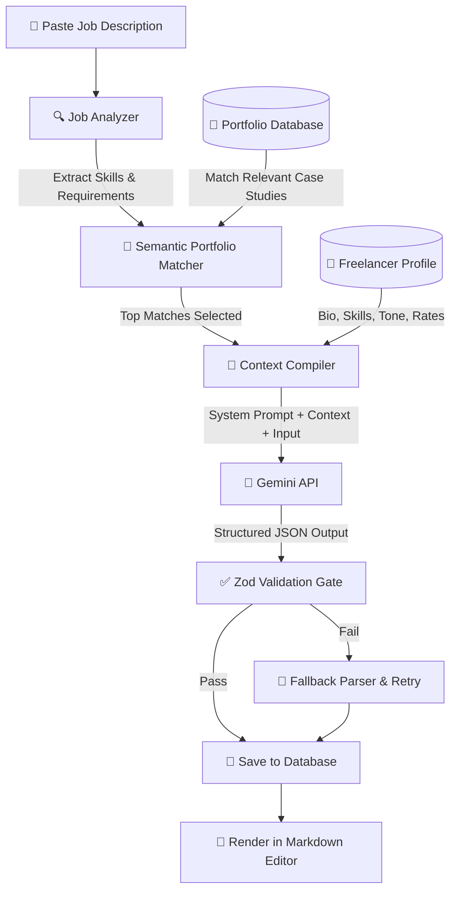
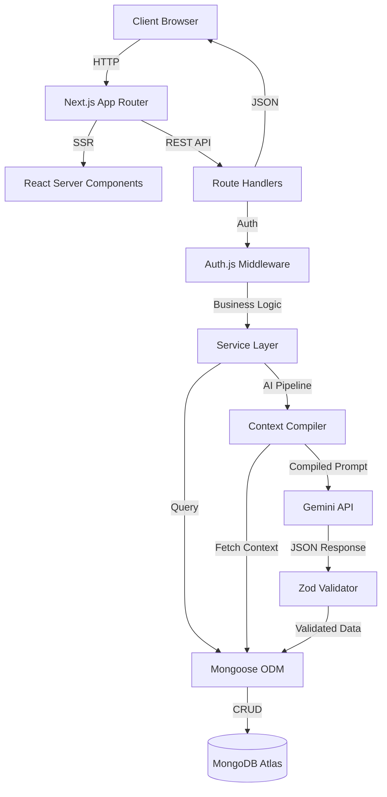

<div align="center">

# FreelAI

### The AI Business Operating System for Freelancers

From finding clients to getting paid — manage your entire freelance business with AI.

[](https://nextjs.org/)
[](https://www.typescriptlang.org/)
[](https://www.mongodb.com/)
[](https://ai.google.dev/)
[](https://tailwindcss.com/)

[](LICENSE)
[]()
[]()

</div>

---

<!-- BANNER -->
<div align="center">


<!-- Replace with actual banner. Recommended size: 1200x630px -->

</div>

---

## Overview

**FreelAI** is a full-stack, AI-native SaaS platform that gives freelancers a single workspace to run their entire business. Instead of juggling separate apps for CRM, invoicing, proposals, and project tracking, FreelAI unifies everything and connects it with an intelligent AI layer.

### The Problem

Freelancers spend **10+ hours per week** on non-billable administrative tasks — drafting proposals, tracking invoices, managing client communications, and manually compiling business data across fragmented tools.

### The Solution

FreelAI eliminates this overhead through context-aware automation. Your portfolio feeds your AI proposal generator. Accepted proposals create project workspaces. Completed projects generate invoices. Analytics track everything. The AI learns your business and works proactively.

### Who It's For

- **Developers & Technical Consultants** — Draft architecture proposals, manage project scopes
- **Designers (UI/UX, Motion, Video)** — Showcase portfolio, generate visual project proposals
- **Copywriters & Marketers** — Tone-controlled AI writing, campaign project tracking
- **Agencies & Consultants** — Client-facing workspaces, multi-project management

---

## Key Features

<table>
<tr>
<td width="50%">

### 🤖 AI Proposal Generator
Paste a job description. The AI analyzes requirements, matches your portfolio, and compiles a tailored proposal — scored and ready to send.

</td>
<td width="50%">

### 👥 Client CRM
Full client relationship management with contact profiles, relationship health scoring, lifetime value tracking, and AI-generated client intelligence.

</td>
</tr>
<tr>
<td width="50%">

### 📋 Project Management
Kanban boards, milestone tracking, budget meters, and time logging. Projects link directly to clients and invoices.

</td>
<td width="50%">

### 💰 Invoice System
Professional invoice editor with line calculators, tax handling, PDF export, lifecycle tracking (Draft → Sent → Paid → Overdue), and automated follow-up reminders.

</td>
</tr>
<tr>
<td width="50%">

### 📂 Portfolio Manager
Structured case study repository with skill tags, media uploads, and visibility controls. Serves as the semantic context library for AI proposal generation.

</td>
<td width="50%">

### 📊 Business Analytics
Revenue charts, proposal win ratios, client payment velocity (DSO), and tax liability estimates — all powered by Recharts.

</td>
</tr>
<tr>
<td width="50%">

### 🧠 AI Copilot
Proactive background intelligence that compiles daily briefings, flags project timeline risks, suggests invoice follow-ups, and recommends rate optimizations.

</td>
<td width="50%">

### ⚡ Mission Control Dashboard
Unified command center with KPI cards, active project tracking, client health indicators, activity feed, and AI-driven quick actions.

</td>
</tr>
</table>

---

## Product Screenshots

> **Note:** Screenshots will be added as the UI reaches visual completion. Each section below will contain actual application screenshots.

<details>
<summary><b>📸 Dashboard (Mission Control)</b></summary>
<br>

<!--  -->
`docs/assets/screenshots/dashboard.png`

KPI metrics, activity feed, AI Copilot widget, and quick action drawer.

</details>

<details>
<summary><b>📸 AI Proposal Generator</b></summary>
<br>

<!--  -->
`docs/assets/screenshots/proposal-generator.png`

Job analysis, portfolio matching, proposal scoring, and Markdown editor.

</details>

<details>
<summary><b>📸 Client CRM</b></summary>
<br>

<!--  -->
`docs/assets/screenshots/clients.png`

Client directory, relationship health badges, and detailed client workspace.

</details>

<details>
<summary><b>📸 Project Management</b></summary>
<br>

<!--  -->
`docs/assets/screenshots/projects.png`

Project grid, milestone tracker, and Kanban task board.

</details>

<details>
<summary><b>📸 Invoice System</b></summary>
<br>

<!--  -->
`docs/assets/screenshots/invoices.png`

Invoice editor, line calculator, PDF preview, and payment lifecycle.

</details>

<details>
<summary><b>📸 Analytics</b></summary>
<br>

<!--  -->
`docs/assets/screenshots/analytics.png`

Revenue charts, win ratios, DSO metrics, and tax estimates.

</details>

<details>
<summary><b>📸 Portfolio Manager</b></summary>
<br>

<!--  -->
`docs/assets/screenshots/portfolio.png`

Case study grid, tag library, and media uploader.

</details>

<details>
<summary><b>📸 Landing Page</b></summary>
<br>

<!--  -->
`docs/assets/screenshots/landing-page.png`

Hero section, interactive AI demo, pricing matrix, and FAQ.

</details>

---

## AI Workflow

FreelAI's AI engine compiles your business context into every generation — no manual copy-pasting required.



**Key Capabilities:**

- **Zero-Hallucination Gate** — Validates that proposals only reference skills and projects actually in your portfolio
- **Proposal Scoring** — AI evaluates your proposal strength (0-100) with specific improvement suggestions
- **Context-Aware Generation** — Pulls your profile, rates, tone preferences, and matching case studies automatically
- **Structured Output** — Uses Gemini's structured JSON output with Zod schema validation

---

## Architecture

FreelAI is built on a multi-tier serverless architecture using the Next.js App Router.



**Architectural Layers:**

| Layer | Responsibility | Location |
|:---|:---|:---|
| **Presentation** | UI rendering, interactivity | `src/app/`, `src/components/` |
| **Gateway** | Routing, CORS, auth verification | `src/middleware.ts` |
| **Business Logic** | Service functions, context compilation | `src/services/` |
| **Data Access** | Schema validation, database queries | `src/models/`, `src/lib/` |
| **External Services** | AI inference, future payment processing | `src/services/ai/` |

---

## Tech Stack

| Category | Technology | Purpose |
|:---|:---|:---|
| **Framework** | [Next.js 15](https://nextjs.org/) | App Router, SSR, serverless API routes |
| **UI Library** | [React 19](https://react.dev/) | Server and Client Components |
| **Language** | [TypeScript 5](https://www.typescriptlang.org/) | Strict type safety across the stack |
| **Styling** | [Tailwind CSS 4](https://tailwindcss.com/) | Utility-first CSS with dark/light themes |
| **Components** | [shadcn/ui](https://ui.shadcn.com/) | Accessible Radix UI primitives |
| **Database** | [MongoDB Atlas](https://www.mongodb.com/) | Document-oriented NoSQL |
| **ODM** | [Mongoose 9](https://mongoosejs.com/) | Schema validation, lifecycle hooks |
| **AI Engine** | [Google Gemini](https://ai.google.dev/) | Structured JSON generation |
| **Auth** | [Auth.js v5](https://authjs.dev/) | OAuth (Google), credentials, sessions |
| **Charts** | [Recharts 3](https://recharts.org/) | SVG data visualization |
| **Animations** | [Framer Motion 12](https://www.framer.com/motion/) | Physics-based transitions |
| **Icons** | [Lucide React](https://lucide.dev/) | Typed SVG icon library |
| **Toasts** | [Sonner](https://sonner.emilkowal.dev/) | Notification system |
| **Command** | [cmdk](https://cmdk.paco.me/) | Command palette (⌘K) |
| **Deployment** | [Vercel](https://vercel.com/) | Edge CDN, serverless scaling |

---

## Folder Structure

```
freelai/
├── docs/                     # Complete project documentation
│   ├── 01-overview.md        # Product overview & vision
│   ├── 02-tech-stack.md      # Technical architecture
│   ├── 04-database.md        # Database schemas & relationships
│   ├── 05-features.md        # Feature specifications
│   ├── 06-ai-system.md       # AI pipeline & workflows
│   ├── 07-design-system.md   # UI guidelines & tokens
│   ├── 08-roadmap.md         # Product roadmap
│   └── 10-development-guide.md  # Coding standards
├── public/                   # Static assets
├── src/
│   ├── app/                  # Next.js App Router
│   │   ├── dashboard/        # Authenticated workspace pages
│   │   │   ├── analytics/    # Business analytics
│   │   │   ├── clients/      # Client CRM
│   │   │   ├── invoices/     # Invoice management
│   │   │   ├── portfolio/    # Portfolio manager
│   │   │   ├── profile/      # Freelancer profile
│   │   │   ├── projects/     # Project management
│   │   │   ├── proposals/    # AI proposal generator
│   │   │   └── settings/     # Configuration
│   │   ├── api/              # REST API route handlers
│   │   ├── login/            # Login page
│   │   └── signup/           # Registration page
│   ├── components/           # Reusable UI components
│   │   ├── ui/               # Base shadcn/ui components
│   │   ├── ai/               # AI-specific components
│   │   ├── layout/           # Page wrappers & navigation
│   │   ├── templates/        # Reusable page templates
│   │   └── status/           # Status badges & indicators
│   ├── hooks/                # Custom React hooks
│   ├── lib/                  # Library initializers
│   ├── models/               # Mongoose schema definitions
│   ├── services/             # Business logic layer
│   ├── styles/               # CSS & design tokens
│   ├── types/                # TypeScript interfaces
│   └── utils/                # Helper utilities
├── AI_CONTEXT.md             # AI assistant context document
├── DESIGN_SYSTEM.md          # Design system reference
└── package.json
```

---

## Getting Started

### Prerequisites

- **Node.js** 18+ 
- **MongoDB Atlas** account (or local MongoDB instance)
- **Google Gemini API** key
- **Google OAuth** credentials (optional, for social login)

### Installation

```bash
# Clone the repository
git clone https://github.com/your-username/freelai.git

# Navigate to the project
cd freelai

# Install dependencies
npm install

# Copy environment variables
cp .env.local.example .env.local

# Configure your environment variables (see below)

# Start the development server
npm run dev
```

The app will be available at `http://localhost:3000`.

### Build

```bash
# Production build
npm run build

# Start production server
npm start

# Lint check
npm run lint
```

---

## Environment Variables

Create a `.env.local` file in the project root with the following variables:

| Variable | Purpose | Required |
|:---|:---|:---|
| `MONGODB_URI` | MongoDB Atlas connection string | ✅ Yes |
| `NEXTAUTH_SECRET` | Auth.js session encryption key | ✅ Yes |
| `GOOGLE_CLIENT_ID` | Google OAuth client ID | Optional |
| `GOOGLE_CLIENT_SECRET` | Google OAuth client secret | Optional |

> **Generate a secret:** `node -e "console.log(require('crypto').randomBytes(32).toString('hex'))"`

---

## Documentation

FreelAI has a comprehensive documentation system inside the `docs/` directory:

| Document | Contents |
|:---|:---|
| [`01-overview.md`](docs/01-overview.md) | Product vision, mission, target audience, value proposition |
| [`02-tech-stack.md`](docs/02-tech-stack.md) | Technical architecture, system diagrams, request flows |
| [`04-database.md`](docs/04-database.md) | MongoDB collections, relationships, ER diagrams, data flows |
| [`05-features.md`](docs/05-features.md) | Feature specifications, user workflows, module connections |
| [`06-ai-system.md`](docs/06-ai-system.md) | AI pipeline, prompt construction, validation gates |
| [`07-design-system.md`](docs/07-design-system.md) | Colors, typography, spacing, component catalog, themes |
| [`08-roadmap.md`](docs/08-roadmap.md) | Product roadmap, completed features, future plans |
| [`10-development-guide.md`](docs/10-development-guide.md) | Coding standards, folder conventions, API patterns |
| [`AI_CONTEXT.md`](AI_CONTEXT.md) | Comprehensive AI assistant context document |

---

## Roadmap

### Completed

- [x] Landing Page — Marketing gateway with hero, pricing, FAQ
- [x] Authentication — Credentials, Google OAuth, session management
- [x] Dashboard — Mission Control with KPIs, activity feed, AI Copilot
- [x] Freelancer Profile — Skills, services, rates, AI preferences
- [x] Client CRM — Directory, health evaluator, client workspace
- [x] Project Management — Milestones, budget tracking, Kanban board
- [x] AI Proposal Generator — Job analysis, portfolio matching, scoring
- [x] Invoice System — Editor, PDF export, lifecycle tracking
- [x] Portfolio Manager — Case studies, tags, media uploads
- [x] Analytics — Revenue charts, win ratios, DSO metrics
- [x] Notifications — In-app alerts, email dispatcher
- [x] Settings — Themes, account management, AI parameters
- [x] AI Copilot — Briefings, risk alerts, recommendations
- [x] Design System — Tokens, components, templates
- [x] Documentation — Complete project documentation

### Planned

- [ ] Stripe Connect — Native payment processing
- [ ] Contracts Suite — Automated contract generation and e-signing
- [ ] Calendar Scheduler — Built-in client call scheduling
- [ ] Email Integration — CRM email sync
- [ ] Autonomous AI Agents — Background proposal drafting, CRM monitoring
- [ ] Browser Extension — Proposal generation on job platforms
- [ ] Workflow Automation — Customizable trigger-action flows
- [ ] Financial Forecasting — Predictive revenue modeling
- [ ] Team Collaboration — Multi-seat agency support
- [ ] Mobile Application — iOS and Android

---

## Contributing

Contributions are welcome. Before contributing, please:

1. **Read the documentation** — Start with [`AI_CONTEXT.md`](AI_CONTEXT.md) and the [`docs/`](docs/) directory
2. **Follow the coding standards** — See [`10-development-guide.md`](docs/10-development-guide.md)
3. **Match the design system** — See [`07-design-system.md`](docs/07-design-system.md) and [`DESIGN_SYSTEM.md`](DESIGN_SYSTEM.md)
4. **Use conventional commits** — `feat(scope): description`, `fix(scope): description`
5. **Branch naming** — `feat/feature-name`, `fix/bug-description`, `docs/target`

### Development Checklist

Before opening a pull request, ensure:

- [ ] Components reuse existing UI elements from `src/components/ui/`
- [ ] Layout is responsive across all breakpoints
- [ ] Both Dark and Light themes render correctly
- [ ] API inputs are validated with Zod
- [ ] Routes require authenticated sessions
- [ ] Error handling uses try-catch with toast notifications
- [ ] `npm run build` passes with zero warnings

---

## License

This project is licensed under the [MIT License](LICENSE).

---

## Author

<table>
<tr>
<td align="center">

**Shivam Goyal**

<!-- Add your links below -->
<!-- [Portfolio](https://your-portfolio.com) · -->
[GitHub](https://github.com/your-username) ·
[LinkedIn](https://linkedin.com/in/your-profile) ·
[Email](mailto:your-email@example.com)

</td>
</tr>
</table>

---

<div align="center">

**Built with AI, for freelancers who build.**

</div>
