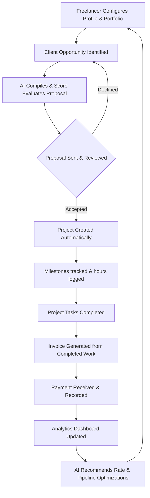

# Product Overview

**Current Status:** Approved  
**Last Updated:** 2026-07-08  
**Related Documents:** [Features Specification](05-features.md), [Roadmap](08-roadmap.md)

---

## 1. What is FreelAI?

FreelAI is an AI-powered Software-as-a-Service (SaaS) platform designed as a unified operating workspace for independent professionals, agencies, and freelancers. It serves as a central hub that automates administrative tasks, simplifies business workflows, and optimizes client relationships.

### Why It Exists
Freelancing offers freedom, but it demands that a single individual acts as a sales representative, project manager, accountant, and service provider. The administrative overhead of managing these roles reduces billable hours, slows growth, and causes burnout. FreelAI exists to eliminate this overhead.

### What Problems It Solves
- **Fragmented Tooling:** Replaces the need for separate apps for CRM, invoicing, project tracking, and proposal generation.
- **Manual Pitching:** Accelerates and improves proposal quality by leveraging the freelancer's portfolio and past data.
- **Payment Latency:** automates professional invoice creation and intelligent client follow-ups.

### Differentiation
Unlike generic project management or invoicing software, FreelAI is built **AI-first**. The artificial intelligence is not an optional add-on; it is the core engine that links data across modules. For example, your portfolio data automatically feeds your AI proposal generator, which directly links to your project management scope and invoicing terms.

---

## 2. Vision

The long-term vision of FreelAI is to establish the **AI Business Operating System (BOS)** for freelancers. 

FreelAI is not merely a utility or a simple AI Proposal Generator. It is the central workspace where freelancers run their entire business. As the platform evolves, the vision expands from reactive tools (which require the freelancer to input and prompt) to **proactive AI agents** that monitor project timelines, analyze client sentiment, predict cash flow shortages, and suggest rate optimization strategies autonomously.

---

## 3. Mission

Our mission is to empower freelancers to focus on their craft by automating their business operations. We achieve this through the following core tenets:

- **Reduce Administrative Work:** Minimize non-billable hours spent on emails, invoice tracking, and document creation.
- **Increase Proposal Success:** Deliver high-converting, tailored proposals using context-aware AI.
- **Proactive AI Assistance:** Transform the AI from a passive chatbot into an active partner that flags risks and identifies opportunities.
- **Save Time and Stress:** Streamline client communication, reduce invoicing friction, and provide clear paths to getting paid faster.

---

## 4. Problem Statement

Freelancers face structural operational challenges that limit their capacity and earnings. FreelAI addresses these directly:

| Freelancer Challenge | The Core Root Cause | FreelAI Solution |
|:---|:---|:---|
| **App Fragmentation** | Managing clients across Trello, Wave, Word, and Google Sheets causes data silos and friction. | **Unified Workspace:** CRM, Projects, Invoices, Portfolios, and AI tools share a single MongoDB data model. |
| **Manual Pitching Bottlenecks** | Drafting custom proposals for every job listing takes hours, reducing outreach volume. | **AI Proposal Generator:** Compiles job requirements with the freelancer's portfolio to write custom pitches in seconds. |
| **Untracked Follow-ups** | Freelancers lose track of sent proposals and pending invoices, leading to missed deals and late payments. | **Automated Reminders:** AI-guided scheduler that sends polite, professional follow-ups to clients. |
| **Lack of Business Insights** | Operating without clear knowledge of client profitability, monthly growth, or tax liabilities. | **Intelligent Analytics:** Recharts-powered dashboard visualizes revenue forecasting, client value, and task efficiency. |

---

## 5. Target Audience

FreelAI is designed for modern independent operators across various creative and technical fields.

### Core User Segments & Needs
- **Developers & Technical Consultants:** Need clean task management, git-like speed, and the ability to draft technical architecture proposals quickly.
- **Designers (UI/UX, Motion, Video Editors):** Require rich media portfolio support, visual invoice presentation, and proposals that clearly communicate design phases.
- **Copywriters & Marketers:** Need tone-of-voice control in AI writing tools, quick client-onboarding flows, and campaign-centric project trackers.
- **Agencies & Multi-disciplinary Consultants:** Require client-facing workspaces, project milestone trackers, and robust billing engines.

---

## 6. Core Value Proposition

FreelAI dramatically simplifies the business of freelancing compared to traditional manual workflows.

| Feature Area | Without FreelAI | With FreelAI |
|:---|:---|:---|
| **Proposal Generation** | Copy-pasting old documents, manually adjusting terms, spending hours on research. | AI compiles custom markdown proposals using direct portfolio-matching logic in seconds. |
| **Client Management** | Contacts kept in emails, spreadsheets, or phone lists. No context tracking. | Central CRM tracking client details, project histories, lifetime value, and "Relationship Health". |
| **Project Tracking** | Sticky notes or separate boards. Disconnected from billing and CRM. | Direct link from won proposal to project board, task tracking, and time logs. |
| **Invoices** | Creating word documents or manually typing lines into third-party billing services. | Single-click invoice generation from completed project tasks, integrated with payment gateways. |
| **Analytics** | Manual math in Excel spreadsheets at the end of the fiscal year. | Dynamic charting showing Monthly Recurring Revenue (MRR), average payment times, and tax estimates. |
| **AI Assistance** | Copy-pasting prompts back and forth to external LLM chatbots. | Native, context-aware AI assistant running background analysis on client risk and rates. |

---

## 7. Product Philosophy

The FreelAI product experience is guided by the following principles:

1. **AI-First, Not AI-Also:** Every feature is designed with AI capabilities natively baked into the schema.
2. **Minimalism & Speed:** High-performance user interfaces built with shadcn/ui and Tailwind CSS. Clean structures with no clutter.
3. **Context Awareness:** The system utilizes existing portfolio, CRM, and task logs to generate precise context for LLM prompts, eliminating the need for manual copy-pasting.
4. **Professionalism & Trust:** Output generated by the platform (proposals, invoices, emails) must match the caliber of top-tier consulting firms.
5. **Automation Over Configuration:** The software should work for the user, automate repetitive steps (like dunning emails), and offer sensible defaults.

---

## 8. Complete Product Workflow

This workflow represents the lifecycle of a freelancer's business operations on FreelAI, showing how data flows seamlessly between modules.

### Workflow Stages
1. **Onboarding & Setup:** Freelancer updates their public profile and portfolio case studies.
2. **Pitching:** User inputs a client request; the AI reviews the portfolio, evaluates a "Portfolio Match", and drafts a custom proposal.
3. **Execution:** Once won, the proposal transforms into a project workspace complete with tasks and milestone trackers.
4. **Billing:** Completed tasks are selected to auto-populate invoices, which are sent directly via email with active payment links.
5. **Review:** Received payments are indexed in the Analytics system to compile revenue trends and generate rates recommendations.

---

## 9. Core Modules

FreelAI is organized into 12 core modules, developed in phases to manage freelancer business operations:

| Module | Purpose | Main Features | Current Status | Future Scope |
|:---|:---|:---|:---|:---|
| **Landing Page** | Platform marketing & public conversion. | Value props, pricing tiers, FAQs, sign-up. | Skeleton | A/B testing, interactive calculator. |
| **Dashboard** | Mission Control overview for authenticated users. | Financial widgets, calendar, alerts, active tasks. | Skeleton | Custom widget drag-and-drop. |
| **AI Proposal Generator** | High-speed, high-conversion pitching engine. | Contextual compilers, tone toggles, PDF export. | Skeleton | Automated scrapers for Upwork listings. |
| **Client CRM** | Lead & relationship directory. | Contact profiles, relationship health, billing logs. | Skeleton | Automatic client email syncing. |
| **Project Management** | Scope organization and task execution. | Kanban boards, task lists, time tracking. | Skeleton | Direct client collaboration portals. |
| **Invoice Management** | Professional billing and reminders. | Line calculators, PDF styling, automatic follow-ups. | Skeleton | Expense logs, Stripe Connect integration. |
| **Analytics** | Financial and metric visualizer. | MRR tracking, client value charts, tax estimators. | Skeleton | Predictive income forecasting. |
| **Portfolio Manager** | Context library for the AI generator. | Case studies structure, tag manager, image uploads. | Skeleton | Direct import from Behance/GitHub. |
| **Freelancer Profile** | Public-facing resume and service list. | Custom domain mappings, contact form, services grid. | Skeleton | Calendar scheduling integrations. |
| **Settings** | Configuration & account panel. | Security, billing, subscription tiers, API keys. | Skeleton | Multi-currency billing preferences. |
| **Authentication** | Access control & security. | Passwordless email login, OAuth (Google/GitHub). | Skeleton | Multi-factor authentication. |
| **Notifications** | Alerts system for critical business events. | In-app notification center, email alerts. | Skeleton | Push notifications to mobile. |

---

## 10. Why AI is Central

In FreelAI, AI is the foundational layer. The platform avoids generic, empty chatbot bubbles in favor of **contextual automation**:

- **Semantic Portfolio Matching:** When a job posting is entered, the AI conducts a semantic search of your portfolio to extract only the case studies and tech stacks relevant to that specific pitch.
- **Relationship Health Monitoring:** By analyzing invoice payment speeds, communication frequency, and project delays, the AI calculates a "Relationship Health Score" to flag accounts that might churn or delay payments.
- **Predictive Risk Assessment:** The system scans task completion velocities and flags projects likely to miss their contract deadlines.
- **Intelligent Invoicing Reminders:** The AI schedules follow-up emails based on historical client response hours, maximizing the probability of immediate payment.

---

## 11. Long-Term Roadmap

The roadmap for FreelAI prioritizes automation depth and ease of access:

- **Autonomous Agents:** AI agents that draft replies to client inquiries automatically and update project boards from conversation contexts.
- **Financial Forecasting:** Machine learning models that predict slow revenue months based on past seasonal trends and pipeline pipelines.
- **Integrations Hub:** Plug-and-play connections to QuickBooks, Xero, Google Calendar, and Slack.
- **Contract Signature Suite:** Draft legally binding consulting contracts automatically based on generated proposal terms.
- **Browser Extension:** A light overlay allowing users to compile proposals directly on platforms like Upwork and LinkedIn.

---

## 12. Success Metrics

To measure the effectiveness of FreelAI for our users, we track the following success metrics:

- **Time Saved (Admin Hours):** Reduce average non-billable administrative hours from 10+ hours a week to under 2 hours.
- **Proposal Win Rate:** Increase average user proposal-to-project conversion rate by 25%.
- **Payment Velocity (DSO):** Decrease Days Sales Outstanding (average payment time) by automating invoice scheduling and follow-ups.
- **Client Retention / LTV:** Increase repeat client business by prompting users to follow up on client profiles with high "Relationship Health".

---

## 13. Frequently Used Terms

- **Mission Control:** The main authenticated dashboard showing all core metrics and action notifications.
- **Proposal Score:** An AI-generated metric (0-100) evaluating the strength of a compiled proposal against a specific job posting.
- **Relationship Health:** A computed score (Good, Fair, At Risk) evaluating the stability of a client account.
- **Portfolio Match:** The degree of overlap between the client's job requirements and the freelancer's uploaded case studies.
- **Client Intelligence:** Contextual records in the CRM outlining a client's preference, payment history, and communication guidelines.

---

## 14. Future Documentation

To explore the technical aspects and codebase layout of the FreelAI project, proceed to the following documents:

1. [02-tech-stack.md](02-tech-stack.md) — Review the technical stack, system architecture, and client-server flow.
2. [04-database.md](04-database.md) — Explore the MongoDB schemas and Mongoose database model relationships.
3. [05-features.md](05-features.md) — Walk through individual feature flows and mockups.
4. [06-ai-system.md](06-ai-system.md) — Dive into the LLM prompts architecture and structured output specifications.
5. [07-design-system.md](07-design-system.md) — Walk through the visual tokens and tailwind style guides.
6. [10-development-guide.md](10-development-guide.md) — Get instructions for local environment setup, testing, and git flows.
