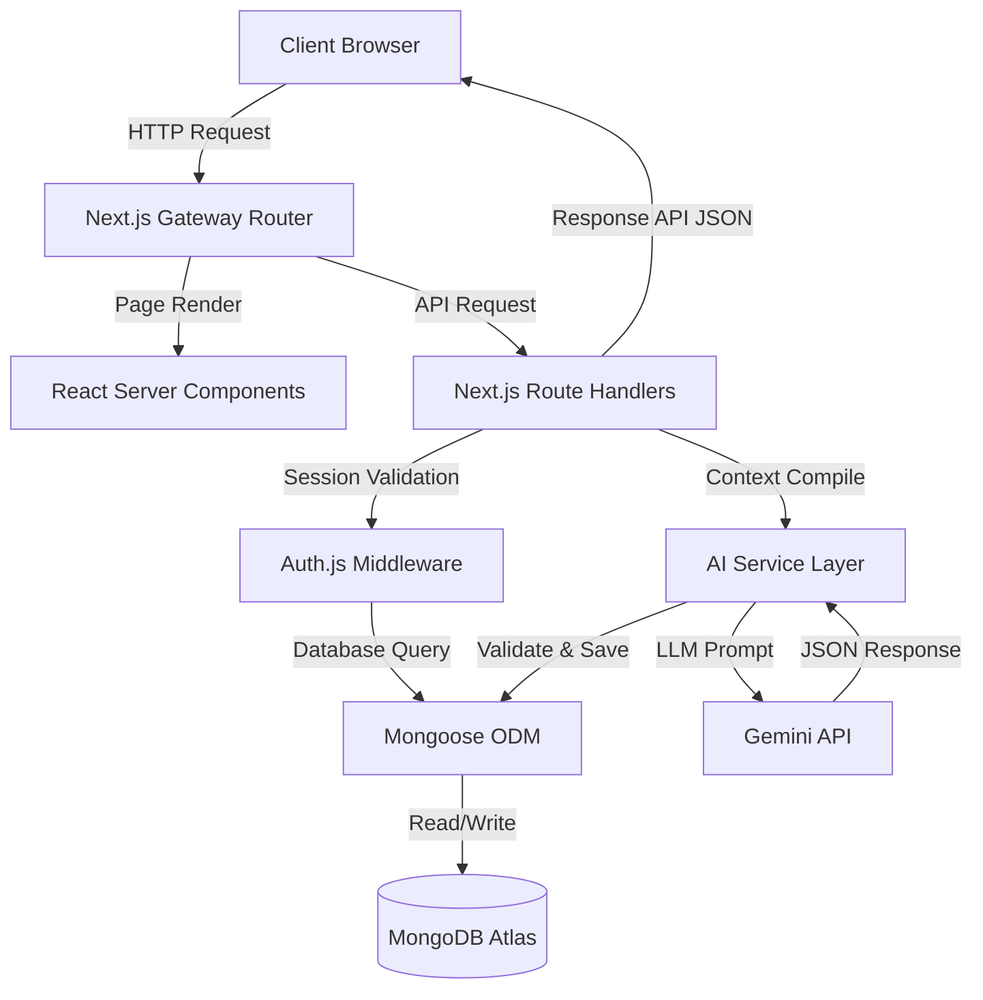
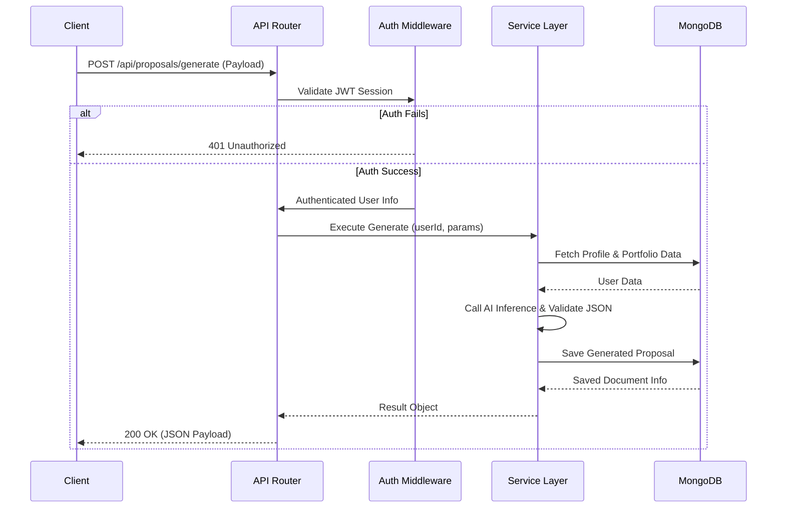
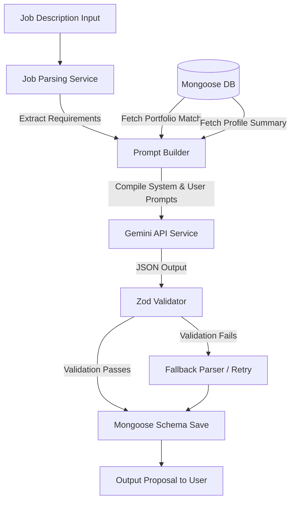
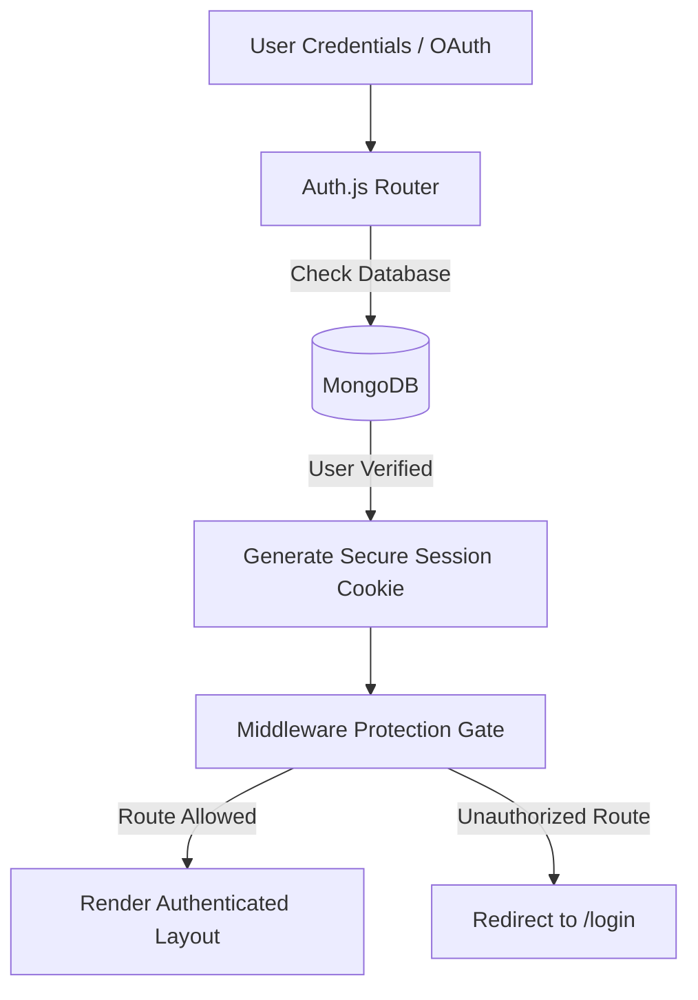
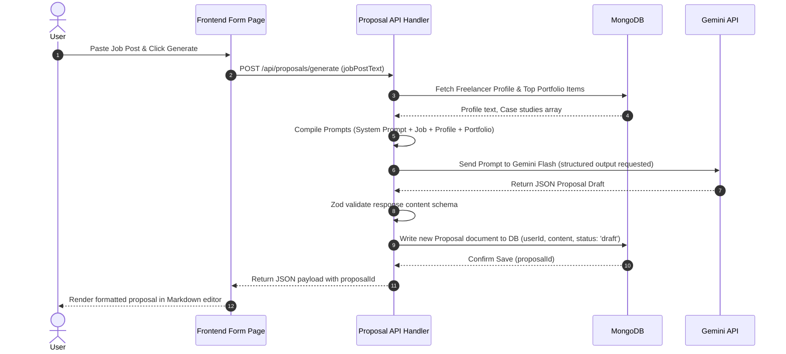

# Technical Stack & System Architecture

**Current Status:** Approved  
**Last Updated:** 2026-07-08  
**Related Documents:** [Product Overview](01-overview.md), [Database Structure](04-database.md), [AI System & Workflows](06-ai-system.md)

---

## 1. Technical Overview

FreelAI is designed as a full-stack, AI-native Software-as-a-Service (SaaS) platform built on the **Next.js App Router**. The system utilizes a serverless architecture where the frontend application layers, backend logic, and API routes are co-located in a single React/TypeScript project.

The high-level philosophy is **context-aware automation**. By storing a freelancer’s CRM data, portfolio pieces, and billing history in a structured database, the application can inject context dynamically into LLM prompts. This architecture enforces separation between presentation, business rules, database access, and AI inference.

---

## 2. Complete Technology Stack

| Technology | Purpose | Reason for Choosing | Current Usage | Future Considerations |
|:---|:---|:---|:---|:---|
| **Next.js 15** | App Framework | Provides hybrid rendering (SSR/ISR/CSR), App Router routing, and Serverless Route Handlers in a single repository. | Core routing, layouts, and API endpoints. | Edge runtime compatibility for lower latency. |
| **React 19** | UI Library | Industry-standard declarative component library integrated natively with Next.js Server Components. | Client components, hooks, state lifecycle. | Deeper integration with React Server Actions. |
| **TypeScript** | Static Typing | Guarantees compile-time type safety across database schemas, APIs, and frontend components. | Strictly typed code base, shared typings. | Compilation speed optimization. |
| **Tailwind CSS 4** | Styling | Utility-first CSS framework enabling rapid UI styling directly in HTML without CSS bloat. | Global styles, component classes, layout grids. | Styling version stability. |
| **shadcn/ui** | Component Library | Unstyled, fully accessible (Radix UI primitives) copy-paste components that fit tailwind themes. | UI components (dialogs, tables, forms, tabs). | Custom variant extensions. |
| **MongoDB** | Primary Database | Document-oriented, scalable NoSQL database that maps natively to JSON structures in JavaScript. | User, client, project, invoice, and proposal records. | Multi-region scaling. |
| **Mongoose** | ODM | Object Document Mapper providing schema validation, middleware hooks, and type safety for MongoDB. | Model compilation and lifecycle hooks. | Prisma or raw driver migration if SQL is needed. |
| **Gemini API** | LLM Engine | Offers high speed, a massive context window, and highly competitive pricing for generating structured JSON. | Proposal drafting, portfolio analysis, rating. | Prompt caching and fine-tuning. |
| **Auth.js (v5)** | Authentication | Modern session management utility designed for Next.js, supporting OAuth and Credentials. | Credentials login and session caching. | Multi-tenant auth isolation. |
| **Recharts** | Data Visuals | React-native SVG charting library that scales cleanly inside layouts. | Dashboard analytics graphs and growth charts. | Server-side rendering charts. |
| **Lucide Icons** | SVG Icons | Light, cleanly typed vector icons package. | Navigation and action button imagery. | Custom icon bundling. |
| **Framer Motion** | Animation | Physics-based animation library that makes layouts feel responsive and interactive. | Page transitions, hover effects, and loaders. | Performance checking on low-end devices. |
| **Vercel** | Hosting | Native deployment platform for Next.js, providing built-in CDN caching and serverless scaling. | Production deployment and branch previews. | Self-hosted Docker alternatives if required. |
| **ESLint & Prettier** | Linter/Formatter | Enforces coding conventions and visual style consistency automatically. | Code validation scripts. | Pre-commit git hook automated checks. |

---

## 3. High-Level System Architecture

FreelAI operates on a multi-tier serverless architecture. The client browser communicates with the serverless Next.js server, which coordinates database read/writes and LLM queries.



### Architectural Layers
1. **Presentation Layer (Frontend):** Consists of Next.js Pages, Layouts, Client Components (React interactive components), and Server Components (read-only database wrappers).
2. **Gateway & Routing Layer:** Handles route matching, CORS headers, and Auth.js session verification.
3. **Business Logic Layer (Services):** Standardized TypeScript service functions located in `src/services/` that handle business logic, context compilation, and external API requests.
4. **Data Access Layer:** Uses Mongoose ODM models to interface with MongoDB.
5. **External Services Gateway:** Interfaces with the Gemini API (for AI operations) and Stripe (for billing).

---

## 4. Frontend Architecture

The frontend is built using Next.js **App Router** conventions to ensure high performance and a clean separation of layout states.

### Core Frontend Guidelines
- **Server Components by Default:** Page layouts and data display components are written as React Server Components (RSC) to fetch database records directly, minimizing client-side javascript payloads.
- **Route Groupings:** Implements organizational routing groups (e.g., `(auth)/` for sign-in layouts and `(dashboard)/` for authenticated dashboard grids) to keep routing logical.
- **Theme & Styles:** Utilizes Tailwind utility tokens and variables inside `src/styles/` mapped to CSS stylesheets. Supports Dark/Light transitions.
- **State Management:** Keeps application state close to the components using native React hooks (`useState`, `useContext`). Global application settings are passed using React Context.
- **Forms & Validation:** Forms utilize standard HTML controls styled with shadcn/ui and validated client-side and server-side using Zod.
- **Visual Charts:** Charts are drawn using Recharts, configured dynamically to scale across desktop, tablet, and mobile layouts.

---

## 5. Backend Architecture

The backend consists of serverless **Route Handlers** (located under `src/app/api/`) and utility functions designed to run on demand in Vercel's serverless environment.

### Request Lifecycle Flow
Every API call undergoes authentication validation, request payload checking, business logic handling, database persistence, and standardized response mapping.



### Core Backend Components
- **Service Layer Pattern:** API handlers do not write database code directly. They delegate to decoupled service functions in `src/services/`, ensuring reusable code blocks.
- **Unified Validation:** Every API route validates input payloads using Zod schemas before running business logic.
- **Global Error Handling:** standard try-catch blocks wrap service executions, mapping database errors and API timeouts to uniform HTTP error payloads:
  ```json
  { "success": false, "error": "ErrorMessage", "details": [] }
  ```

---

## 6. Database Layer

FreelAI uses **MongoDB** as its main transactional database. MongoDB's NoSQL document structure matches the dynamic nature of project management tasks, AI proposal structures, and changing client schemas.

### Database Principles
- **Data Isolation & Tenant Security:** Every collection document contains a `userId` field linking the record to a specific authenticated freelancer account. All queries MUST filter by `userId` to prevent cross-account leaks.
- **Schema Validation:** Mongoose schemas enforce data integrity on write (e.g., matching email regexes, restricting status enums).
- **Indexing Philosophy:** Standard indexes are placed on foreign key links (such as `userId`, `clientId`, and `projectId`). Compound indexes are utilized where sorting occurs (e.g., `{ userId: 1, createdAt: -1 }`).

Detailed model definitions, properties, and relationships are documented in [04-database.md](04-database.md).

---

## 7. AI Architecture

Artificial Intelligence in FreelAI is isolated in dedicated service wrappers to prevent LLM dependency leakage into the core business logic.



### AI Pipeline Separation
- **Prompt Compilers:** Prompt templates (located in `src/services/ai/prompts.ts`) compile user-entered descriptions with database-fetched summaries.
- **Strict Formatting Control:** The application requests structured outputs from the Gemini SDK, utilizing JSON schemas matching target TypeScript types.
- **Validation Gates:** Once returned, the JSON is immediately parsed using Zod models. If validation fails, the service attempts to parse using regex fallback models or triggers a retry request.

---

## 8. Authentication Flow

Authentication is managed via **Auth.js (v5)**, handling token creation, cookie management, and user routing.



### Authorization Architecture
- **Protected Routes:** Next.js Middleware intercepts incoming browser navigation requests and rejects access to dashboard subdirectories if a valid session cookie is missing.
- **API Authorization:** API handlers extract token information on every request. If the token is missing or expired, the API immediately throws a `401 Unauthorized` response.
- **Tenant Enforcement:** Database collections include security filters checking `currentSession.userId === document.userId`.

---

## 9. Folder Structure

FreelAI follows a logical directory layout designed to prevent scaling chaos.

```
freelai/
├── docs/                # Project documentation system
├── public/              # Static assets (logos, icons)
├── src/
│   ├── app/            # Next.js App Router (Layouts, Routing pages, APIs)
│   │   ├── (auth)/     # Routing group for registration/login pages
│   │   ├── (dashboard)/# Routing group for authenticated dashboard views
│   │   └── api/        # REST Serverless Route Handlers
│   ├── components/     # Reusable global UI elements (button, dialog, input)
│   ├── features/       # Feature-specific components, hooks, and types
│   ├── hooks/          # Shared custom React hooks (useWindowSize, useAuth)
│   ├── lib/            # Shared initializers (db connect, gemini SDK client)
│   ├── models/         # Mongoose DB schema model classes
│   ├── services/       # Core business logic layer (AI compiler, billing, CRM)
│   ├── styles/         # Global stylesheets and tailwind layout config
│   └── types/          # Shared TypeScript interfaces & schemas
├── mkdocs.yml           # Documentation platform config
├── package.json         # NPM dependency manifest
└── tsconfig.json        # TypeScript configuration settings
```

---

## 10. Data Flow: Proposal Generation Request

This sequence diagram tracks the flow of a proposal request, showing the exact steps required to generate a job pitch.



---

## 11. Design Principles

Engineers contributing to FreelAI must adhere to the following principles:

- **Separation of Concerns:** Keep UI styling, API controllers, database queries, and AI generation logic decoupled in distinct modules.
- **Strict Type Safety:** Avoid using the `any` keyword. Compile-time typing should cover all data passing through components, network channels, and database queries.
- **Single Source of Truth:** Share validation rules (e.g. Zod schemas) between frontend forms and backend REST handlers.
- **Context-Aware Design:** Ensure components leverage context values and hooks rather than storing duplicate global states.
- **Fail Gracefully:** Implement UI boundary fallbacks and API error responses for third-party endpoints.

---

## 12. Performance Considerations

Optimizations are applied to maintain rapid load times and low server execution footprints:

- **Server-Side Rendering (SSR):** Next.js Server Components load database data directly, bypassing client fetch roundtrips.
- **Dynamic Imports & Code Splitting:** Heavy UI components (like dashboards and charting libraries) are loaded dynamically using React's `lazy` and Next.js `dynamic` utilities, shrinking initial download sizes.
- **Database Connection Pooling:** Implements cached connection states to prevent MongoDB pool starvation during high-frequency serverless invocations.
- **Responsive Layouts:** Utilizes mobile-first tailwind design strategies and dynamic image scaling.

---

## 13. Security Considerations

Security measures ensure data privacy across all layers:

- **Strict Tenant Separation:** Database writes and reads must query using the user session's `userId`.
- **Zod Input Sanitization:** Rejects malformed REST payloads before they reach MongoDB queries, preventing injection attacks.
- **Prompt Injection Defense:** Job descriptions and client emails are treated as unverified text inputs. They are strictly encapsulated in isolated JSON key blocks in LLM instructions to prevent systemic execution overrides.
- **Secure Credentials:** API keys, database connection strings, and authorization secrets are loaded exclusively via environment variables on the server.

---

## 14. Scalability Strategy

As FreelAI expands, the architecture is ready to support scaling upgrades:

- **SQL Migration Path:** If transactional relationships between projects, invoices, and CRM tables require rigorous integrity, schemas are mapped to support migration to PostgreSQL / Supabase.
- **Redis Cache Layer:** Add Redis to cache frequently fetched data (such as user dashboard summaries and profile records).
- **Background Task Queues:** Move slow tasks (like rendering PDF invoices, compiling ZIP portfolios, and dispatching mass dunning emails) to serverless worker services (e.g., Inngest, BullMQ).
- **Autonomous Agents:** Build worker scripts that run periodically using cron schedules to execute proactive client relationship health checks.

---

## 15. Future Documentation

To explore specific modules, models, or guidelines in details, check the following documents:

1. [04-database.md](04-database.md) — Dive into database collections and Mongoose properties.
2. [05-features.md](05-features.md) — Inspect the application features and individual workflows.
3. [06-ai-system.md](06-ai-system.md) — Review LLM parsing pipelines, templates, and Zod schemas.
4. [07-design-system.md](07-design-system.md) — Walk through tailwind configurations and shadcn variables.
5. [10-development-guide.md](10-development-guide.md) — Get instructions for local setup, seeding, and Git commands.
