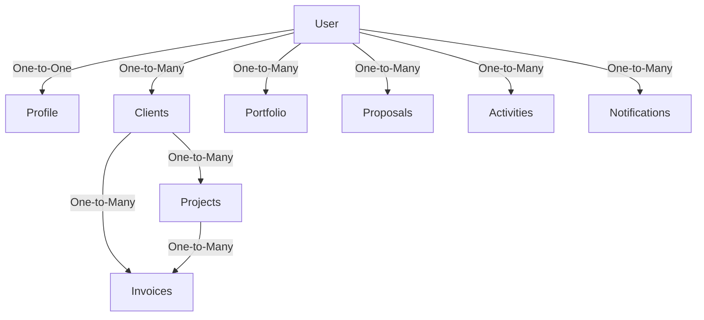
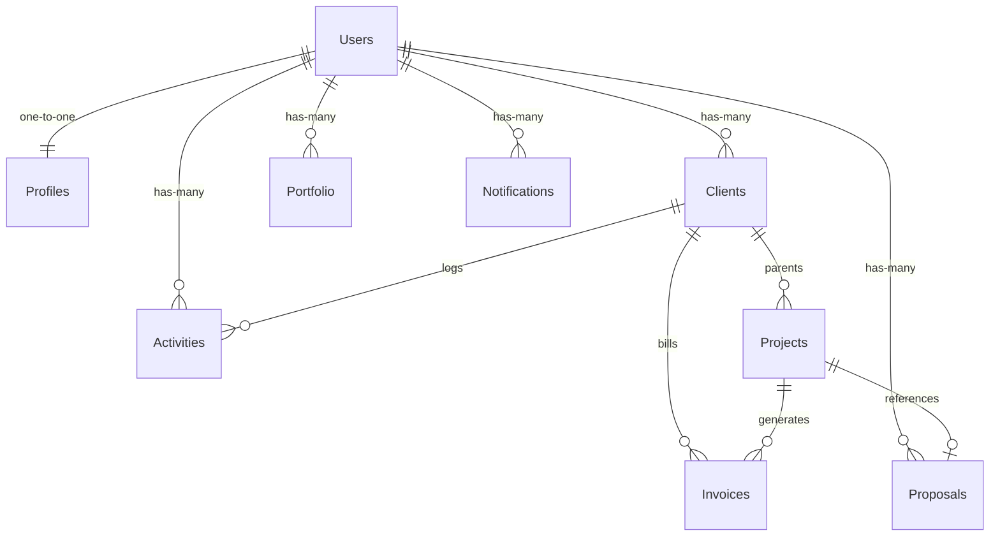
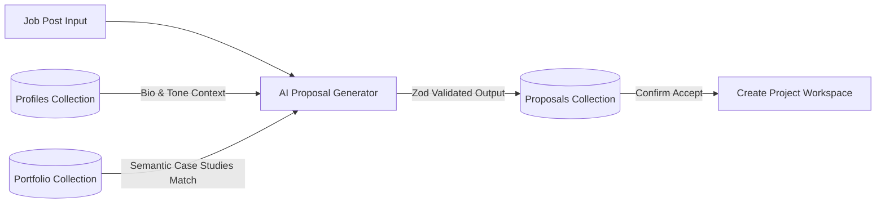
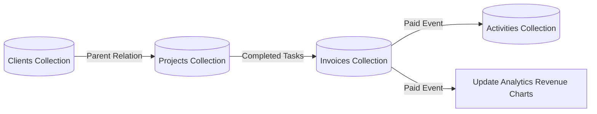
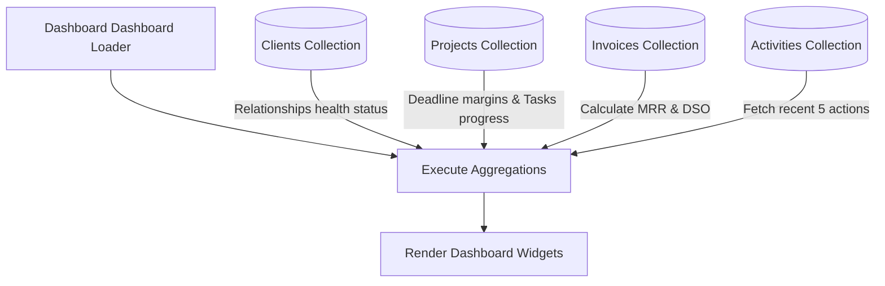

# Database Structure & Data Model

**Current Status:** Approved  
**Last Updated:** 2026-07-09  
**Related Documents:** [Technical Stack & Architecture](02-tech-stack.md), [AI System & Workflows](06-ai-system.md), [Features Specification](05-features.md)

---

## 1. Database Overview

FreelAI utilizes **MongoDB** as its primary transactional database. MongoDB was selected for its alignment with the platform's AI-first workflows and rapid development lifecycle:

- **Flexible Document Structure:** AI-generated outputs (such as proposals and analysis matrices) are complex, nested JSON objects. Storing these directly as documents avoids the overhead of flattening data into multiple SQL tables.
- **AI-Friendly Storage:** Model inputs and outputs are handled natively as documents, simplifying the serialization and validation of structured JSON.
- **Easy Schema Evolution:** As new features are added, schemas can be updated without performing complex table migration scripts.

### Multi-Tenant Philosophy
The core database philosophy is **user-level isolation**. Every piece of business data is owned by a single authenticated freelancer account. A global `userId` parameter is embedded in every collection (except the core authentication user registry itself) to enforce tenant isolation at the query layer.

---

## 2. Database Architecture

The diagram below represents the logical hierarchy of the database collections. The User collection acts as the root boundary.

### Relationship Design
- **Root Collections:** Profile, Clients, Portfolio, Proposals, Activities, and Notifications are directly associated with the User account via the `userId` field.
- **Child Collections:** Projects and Invoices are linked to a specific Client record via `clientId`. 
- **Cross-Links:** Invoices and Proposals can optionally reference a specific `projectId` or `proposalId` to preserve the lifecycle trail.

---

## 3. Collections Overview

The table below catalogs all collections within the FreelAI schema:

| Collection | Purpose | Owner | Related Collections | AI Usage |
|:---|:---|:---|:---|:---|
| **Users** | Core account registry & Auth.js sessions. | System | Profiles, Clients, Portfolios | Used to verify authentication states. |
| **Profiles** | Freelancer biography, services, and AI preferences. | User | Users | Core context injector for all prompt generations. |
| **Clients** | Client CRM directory. | User | Projects, Invoices, Activities | Scanned to evaluate account relationship health. |
| **Projects** | Project scopes, milestones, and task boards. | User | Clients, Invoices, Proposals | Audited to predict timeline risks. |
| **Invoices** | Billing invoices and payment statuses. | User | Clients, Projects | Scanned to monitor DSO and cash flow. |
| **Proposals** | Generated pitches, scores, and job posting text. | User | Clients, Projects, Portfolios | Input opportunity analyzed; matched case studies. |
| **Portfolio** | Case studies, skills, and project media tags. | User | Users | Semantic database queried for job matches. |
| **Activities** | Audit log tracking actions for the dashboard feed. | User | Users, Clients, Projects | Analyzed to build daily briefings. |
| **Notifications** | In-app user notifications and system alerts. | User | Users, Invoices, Projects | AI triggers alerts for late bills or project risks. |

---

## 4. User Collection

### Purpose
Manages user authentication credentials, basic contact records, and Auth.js session records.

### Stored Information
- **Auth Credentials:** Hashed password, email address, username, provider verification flags (for Google/GitHub OAuth logins).
- **Metadata:** Account creation timestamps, active session tokens.

### Relationships
- Has a one-to-one relationship with the **Profile** collection.
- Has a one-to-many relationship with all other business collections via the primary key `_id` mapped as `userId`.

### Data Isolation & AI Usage
The User ID (`userId`) acts as the security partition. No query can run in the application layer without validating that the requested document's `userId` matches the verified session ID. The AI system does not query this collection directly; it is used exclusively to scope the database context queries.

---

## 5. Freelancer Profile

### Purpose
Maintains the professional profile, skills, rates, and custom AI templates of the freelancer.

### Stored Information
- **Professional Details:** Full name, title, biography, years of experience.
- **Skills Directory:** Array of tags (e.g., `["React", "MongoDB", "Figma"]`).
- **Services Array:** Pricing models, hourly rates, and standard service descriptions.
- **Preferences:** Languages spoken, availability status, and writing tone instructions (e.g. "Write direct, clear, and highly technical pitches").

### AI Source of Truth
This collection is the primary personalization context. The Prompt Builder fetches these settings on every generation request to ensure that the drafted text matches the user's expertise and writing style.

---

## 6. Clients Collection

### Purpose
Stores client contact records and tracks CRM relationship health indicators.

### Stored Information
- **Contact Details:** Contact name, email, phone, organization, social media URLs.
- **Financial Metrics:** Total revenue earned, total outstanding invoice values.
- **Relationship Health Metric:** Value indicating relationship status (`Good`, `Fair`, `At Risk`).

### Relationships
- Links to the **User** via `userId`.
- Parents the **Projects** and **Invoices** collections.

### AI Usage
The CRM Agent evaluates relationship health by scanning invoice payments speeds (Days Sales Outstanding) and communication frequencies, flagging late-paying or inactive clients.

---

## 7. Projects Collection

### Purpose
Tracks project scopes, budgets, milestones, and task statuses.

### Stored Information
- **Details:** Title, description, current status flag (`Planning`, `Active`, `Done`).
- **Financials:** Total budget, hours logged, billing method (Fixed vs Hourly).
- **Milestones Array:** Deadlines, titles, and completion boolean states.
- **Tasks Board:** Drag-and-drop task card positions and descriptions.

### Relationships
- Linked to the **User** via `userId` and the **Client** via `clientId`.
- Optionally references a `proposalId` if generated from an AI pitch.

### AI Usage
The system reviews task progress speeds and deadline margins to generate "Project Risk Warnings" on the dashboard when a milestone is at risk of slipping.

---

## 8. Proposals Collection

### Purpose
Stores the history of job applications, AI ratings reports, and generated pitches.

### Stored Information
- **Opportunity Details:** Raw job description text, parsed skills requirements.
- **Generated Output:** Markdown proposal text, suggested pricing, estimated timeline.
- **Evaluation Metrics:** AI Proposal Score (0-100), grading analysis points list.
- **Status Tracker:** Proposal state (`Draft`, `Sent`, `Accepted`, `Declined`).
- **Portfolio Match List:** IDs of matching portfolio case studies.

### Immutability Principle
Proposals are saved as **immutable records** once created or updated by the user. If the user requests a regeneration, a new proposal document is created. This history permits users to review past proposal scores and tracks how changes to prompt inputs impact overall conversion rates.

---

## 9. Invoices Collection

### Purpose
Coordinates billing line items, payment terms, and invoice documents.

### Stored Information
- **Details:** Invoice number, invoice date, due date, billing status (`Draft`, `Sent`, `Paid`, `Overdue`).
- **Line Items:** Descriptions, quantities, unit rates, tax percentages, discounts.
- **Payment Log:** Payment receipt dates, Stripe reference IDs.

### Relationships
- Mapped to **User** via `userId` and **Client** via `clientId`.
- Optionally references `projectId` if generated from completed tasks.

### AI Usage
The invoicing ledger provides the raw data for MRR calculations, revenue forecasts, and client payment speed analysis (DSO).

---

## 10. Portfolio Collection

### Purpose
Houses case studies that serve as the contextual background for the AI proposal generator.

### Stored Information
- **Case Study Details:** Title, problem description, solution delivered, key results.
- **Metadata Tags:** Technology list (e.g. `["Tailwind", "Next.js"]`), skill categories.
- **Visual Assets:** Array of file paths to compressed WebP screenshots.
- **Status Toggles:** Visibility settings (`Public`, `Private`, `Featured`).

### AI Usage
The Proposal Generator conducts semantic search queries on the portfolio collection to find the most relevant case studies for a job posting.

---

## 11. Activities Collection

### Purpose
Provides a time-series log of all user operations to populate the dashboard activity feed and build the audit trail.

### Stored Information
- **Logs:** Action title, category tag (e.g. `Invoice`, `Project`), description.
- **Identifiers:** References to associated `clientId` or `projectId`.
- **Timestamp:** Precise event creation date.

### AI Usage
The AI Copilot scans the activities log of the past 24 hours to compile the Daily Briefing greeting on the dashboard.

---

## 12. Notifications Collection

### Purpose
Coordinates transactional user notifications and system alerts.

### Stored Information
- **Content:** Alert message, priority ranking (`Low`, `Medium`, `High`).
- **Status:** Read/Unread boolean flags.
- **Trigger Type:** System event tag (e.g., `Overdue Invoice`, `AI Risk Alert`).

### AI Usage
The background project and financial estimators write alerts directly to the Notifications collection when risk anomalies are detected.

---

## 13. Data Relationships (Entity Relationship Diagram)

This ER diagram illustrates the primary references and linking paths between collections:

---

## 14. Data Flows

### A. Proposal Generation Data Flow

### B. Client & Billing Flow

### C. Dashboard Metrics Assembly

---

## 15. AI Data Usage Policy

To guarantee privacy and accurate results, strict rules govern what data the AI services can access.

### AI Access Permissions Matrix
- **Profile:** READ only (to extract skills, bio, writing tone specifications).
- **Portfolio:** READ only (semantic matching for opportunities).
- **Clients:** READ only (analyzing payment histories to assess risk).
- **Projects:** READ only (scanning task boards to forecast delays).
- **Invoices:** READ only (calculating DSO rates and revenue histories).

### Context Isolation
AI engines **never** write directly to the database without a validation step. The pipeline compile-engine retrieves records filtering strictly by the logged-in user session’s `userId`, preventing cross-user data exposure.

---

## 16. Security

Data security is managed through multi-layered code policies:

- **Strict Tenant Separation:** Document schemas include a `userId` field (typed as Mongoose `Schema.Types.ObjectId`). Database controllers append `{ userId: currentSession.userId }` to all find/update/delete operations.
- **Middleware Validation:** Incoming REST payloads are validated via Zod schemas, stripping out illegal or mismatched ID parameters.
- **Soft Delete Policy:** Critical collections (Clients, Projects, Invoices) implement soft-deletes using a `deletedAt: Date` flag, protecting against accidental data loss.
- **Input Sanitization:** API route controllers sanitize query parameters to prevent MongoDB query injection attacks.

---

## 17. Indexing Strategy

Indexes are configured on frequently queried fields to ensure sub-millisecond lookups as collections grow:

- **`Users.email` (Unique):** Used for auth lookups.
- **`userId` (Single Field):** Configured on Profiles, Clients, Projects, Invoices, Proposals, Portfolios, Activities, and Notifications, as almost every database read filters by user session ID.
- **`clientId` & `projectId` (Single Field):** Configured on Projects and Invoices to optimize child-lookup performance.
- **`status` & `createdAt` (Compound):** Configured on Invoices and Activities (e.g. `{ userId: 1, createdAt: -1 }`) to ensure rapid loading of sorted dashboard tables.

---

## 18. Future Database Evolution

Planned schema additions as FreelAI scales:

- **Contracts:** Schema mapping legal contract terms, signatures, and PDF hashes.
- **CalendarEvents:** Tracks scheduling data and meeting summaries.
- **EmailThreads:** Stores message timelines for direct CRM messaging.
- **Payments:** Tracks subscription details, transaction logs, and Stripe hooks.
- **Subscriptions:** Handles tier details (Free, Pro, Enterprise) and feature caps.
- **AIMemory:** Tracks user-corrected AI habits to improve proposal suggestions.

---

## 19. Database Best Practices

Engineers modifying the FreelAI database layer must follow these principles:

- **Single Source of Truth:** Do not duplicate profile details or client contacts across collections. Use database references (`ObjectId`) instead.
- **Referential Integrity:** Ensure cascade logic is defined; deleting a Client should soft-delete linked Projects and Invoices.
- **Immutability of History:** Financial ledgers (Invoices) and proposal results (Proposals) must remain immutable once finalized to ensure audit trail accuracy.
- **Standardized Fields:** All collections must utilize `createdAt` and `updatedAt` timestamps.
- **Atomic Operations:** Use atomic MongoDB updates (such as `$set`, `$push`, `$inc`) instead of fetching, modifying, and saving entire documents, preventing write race-conditions.

---

## 20. Related Documentation

To explore further aspects of the FreelAI platform, proceed to the following guides:

1. [01-overview.md](01-overview.md) — Product vision, modules, and glossary.
2. [02-tech-stack.md](02-tech-stack.md) — Tech stack, system layout, and API workflows.
3. [05-features.md](05-features.md) — Feature specifications and user workflows.
4. [06-ai-system.md](06-ai-system.md) — LLM pipelines, prompt contexts, and validation schemas.
5. [07-design-system.md](07-design-system.md) — Tailwind tokens, typography, and styling variables.
