# Product Features Specification

**Current Status:** Approved  
**Last Updated:** 2026-07-08  
**Related Documents:** [Product Overview](01-overview.md), [Database Structure](04-database.md), [AI System & Workflows](06-ai-system.md)

---

## 1. Landing Page

### Purpose
The public Landing Page is the primary marketing and customer acquisition gateway. It explains the core value proposition of FreelAI, targets pain points, and converts anonymous visitors into registered users.

### User Goals
- Understand the product features and how FreelAI helps freelancers.
- Compare subscription pricing tiers.
- Find answers to frequently asked questions.
- Create a new account or log into an existing account.

### Main Features
- **Hero Section:** Clear value proposition message with a primary Call-to-Action (CTA).
- **Interactive Product Preview:** Dynamic visual elements displaying mockups of the Dashboard, Proposal Builder, and Invoice tools.
- **AI Business Partner Demonstration:** Inline interactive simulation showcasing how the AI parses a job posting and matches it with portfolio case studies.
- **Pricing Matrix:** Table mapping Free, Pro, and Agency tiers.
- **FAQ Accordion:** Answers regarding data security, integrations, and pricing.

### User Workflow
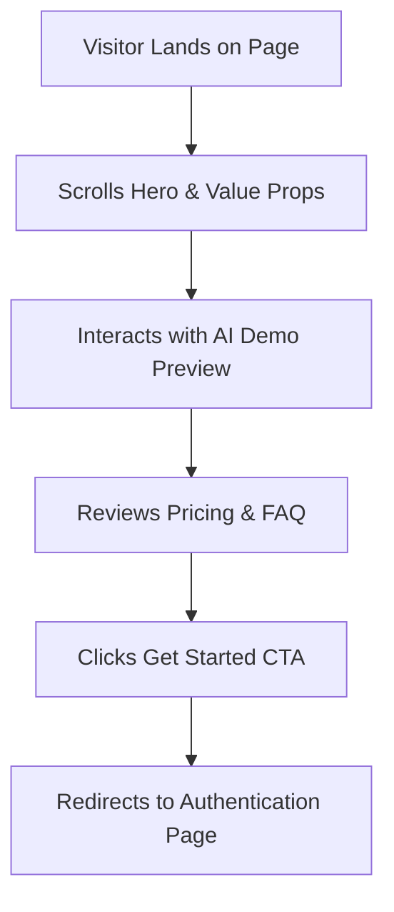

### Inputs
- No user input required for passive scrolling.
- Job post text simulation inside the interactive AI demo widget.

### Outputs
- Visual presentation of FreelAI value propositions.
- Simulated proposal output matching the demo job post.

### Connected Features
- **Authentication:** Direct routing to signup/login.

### AI Usage
- **Interactive Simulation:** Pre-computed static mock AI generations showing visitors how raw input is compiled and matched to portfolios.

### Future Improvements
- [ ] Direct interactive sandbox allowing visitors to paste a small real-world job posting for a limited test output.

---

## 2. Authentication

### Purpose
Provides secure access control, session management, and user data isolation across the FreelAI platform.

### User Goals
- Register a new account securely.
- Log into an existing workspace.
- Keep sessions active across multiple visits without constant re-authenticating.
- Safely log out to prevent unauthorized device access.

### Main Features
- **Registration Form:** Credentials signup (Email, Password, Username).
- **OAuth Login:** Fast sign-in using Google and GitHub providers.
- **Passwordless Magic Links:** Secure token-based email login.
- **Protected Routing:** Prevents unauthorized navigation to `/dashboard` or `/settings` routes.
- **Logout Action:** Invalidates session tokens and cookies immediately.

### User Workflow
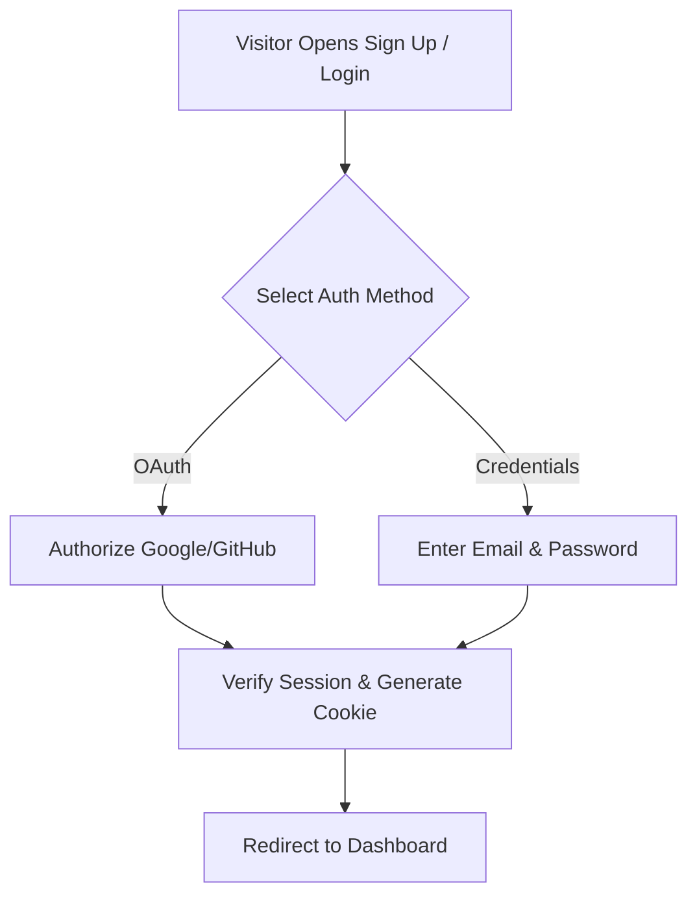

### Inputs
- User Credentials (email, password, usernames).
- OAuth provider callback authorization code.

### Outputs
- Secure session cookie (JWT).
- Redirect triggers to internal routes.

### Connected Features
- **Dashboard:** Session validation unlocks the dashboard layout.
- **Settings:** Manages profile credentials.

### AI Usage
- AI is not used in this module.

### Future Improvements
- [ ] Multi-Factor Authentication (MFA) implementation.

---

## 3. Dashboard (Mission Control)

### Purpose
The authenticated homepage and "Mission Control" panel. It provides freelancers with a consolidated, real-time snapshot of active projects, billing pipelines, relationship dynamics, and immediate tasks.

### User Goals
- View daily earnings and total revenue figures at a glance.
- Monitor active projects status and upcoming milestone deadlines.
- Check relationship safety ratings and alerts.
- Execute quick actions like drafting a proposal or sending an invoice.

### Main Features
- **Daily Briefing Widget:** Personalized text greeting highlighting the day's tasks and late payments.
- **KPI Metrics Cards:** Cards tracking: Month-to-date Revenue, Average Invoice Payment Velocity, and Active Proposals.
- **Active Projects Table:** Simple progress tracking list.
- **Client Health Dashboard:** Highlights client accounts that are "At Risk" based on past metrics.
- **Quick Action Drawer:** Fast access triggers for main features.
- **AI Copilot Widget:** Proactive card listing recommended tasks compiled by background analysis.

### User Workflow
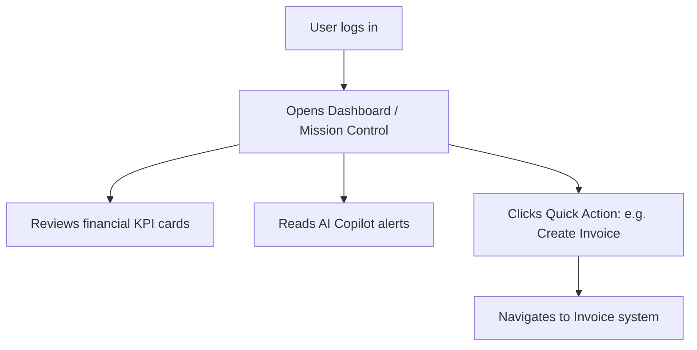

### Inputs
- User database session state.

### Outputs
- Aggregated graphs, lists of active items, and priority task alerts.

### Connected Features
- **CRM / Projects / Invoices:** Pulls metrics dynamically to show status.
- **Analytics:** Feeds financial details directly to chart blocks.
- **AI Copilot:** Feeds context to compile proactive notification cards.

### AI Usage
- **Daily Briefing compiler:** Summarizes user tasks, unpaid bills, and calendar schedules into a natural-language paragraph greeting.

### Future Improvements
- [ ] Drag-and-drop dashboard grid personalization.

---

## 4. Freelancer Profile

### Purpose
Acts as the central configuration directory defining the freelancer's identity, skills, services, availability, and AI preferences. It is the primary "source of truth" context injector for all AI prompts.

### User Goals
- Input professional biography, expertise tags, and pricing parameters.
- Define service offerings and package deals.
- Set general availability and client communication preferences.
- Save custom instructions for the AI generator (e.g. preferred tone, formatting).

### Main Features
- **Profile Configuration Form:** Setup profile tags, experience level, and languages.
- **Services Grid Builder:** Add service structures (hourly rates, package scopes).
- **Availability Toggles:** Set current capacity (Accepting Clients, Busy, Away).
- **AI Custom Instructions Engine:** Define custom rules for LLM generation.

### User Workflow
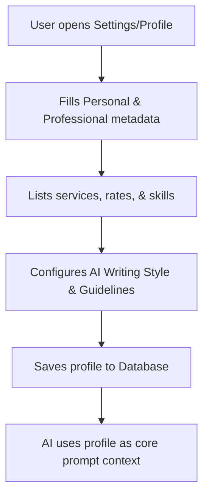

### Inputs
- Freelancer personal details, biography text, services details, and AI style parameters.

### Outputs
- Saved Profile document linked to `userId`.

### Connected Features
- **AI Proposal Generator:** Directly utilizes profile skills and custom instructions during prompt compilation.
- **Freelancer Public Page:** Visual output structure.

### AI Usage
- **AI Settings Mapping:** The profile defines target templates and restrictions (e.g., "Always write in a casual tone", "Include a brief summary of my React experience") which dictate prompt assembly.

### Future Improvements
- [ ] Automatic profile optimization recommendations based on proposal success analytics.

---

## 5. Client CRM

### Purpose
Allows freelancers to track and organize their professional network of clients, analyze accounts value, and flag relationship risks.

### User Goals
- Log new client contacts and organization metadata.
- Track communication logs and lifetime value metrics.
- Keep record of projects and payment efficiency per client.
- Identify clients with declining interaction rates.

### Main Features
- **Client Directory:** List view with search, filter, and sort capabilities.
- **Client Creator Form:** Email, organization, custom contacts, and social URLs fields.
- **Relationship Health Evaluator:** Metrics-based rating system (Good, Fair, At Risk).
- **LTV Tracker:** Total revenue earned vs total outstanding invoiced amounts.

### User Workflow
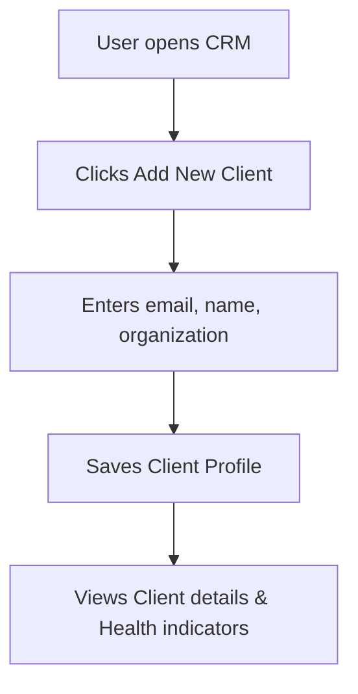

### Inputs
- Client contact parameters and organization details.

### Outputs
- Client database record.

### Connected Features
- **Projects:** Associate tasks and deadlines with client records.
- **Invoices:** Map invoices to client records.

### AI Usage
- **Health Evaluator:** Background analysis estimating relationship safety based on invoice payments velocity and email response timelines.

### Future Improvements
- [ ] Sync email threads automatically into CRM logs.

---

## 6. Client Details

### Purpose
A deep-dive workspace for a single client account, grouping history, communication records, and revenue analytics.

### User Goals
- Inspect project timelines and upcoming milestones for a specific client.
- Track historical payments and unpaid invoices.
- Pin notes, instructions, or specific formatting rules.
- Review AI-compiled summaries of the client's preferences.

### Main Features
- **Metrics Summary Bar:** Total Revenue, Open Projects, and Average DSO.
- **Timeline Tab:** Unified stream showing invoices sent, projects completed, and email dates.
- **Pinned Notes Widget:** Secure text editor for key client requirements.
- **AI Client Intelligence Block:** Explains client habits (e.g., "Prefers short emails, usually pays on Fridays").

### User Workflow
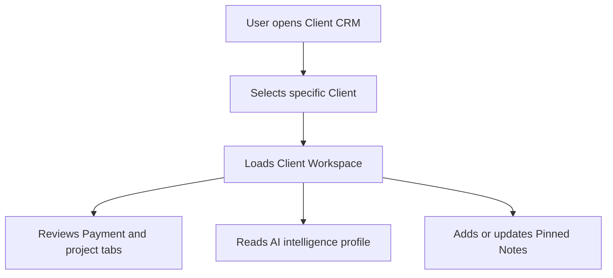

### Inputs
- CRM selections.
- Pinned note text updates.

### Outputs
- Unified client ledger view.
- Compiled notes updates.

### Connected Features
- **Invoices / Projects:** Feeds tabs with mapped records.
- **AI Copilot:** Pulls client details for context.

### AI Usage
- **AI Client Summary compiler:** Scans historical project results, emails, and payment dates to summarize client communication styles and operational patterns.

### Future Improvements
- [ ] Automatic contract templates matching client industry specifications.

---

## 7. Project Management

### Purpose
Enables freelancers to define project scopes, assign tasks, log progress, and flag timeline bottlenecks.

### User Goals
- Create and organize project timelines.
- Structure deliverables into clear milestones.
- Track project budgets vs current hours spent.
- Link projects to client CRM profiles for easy reference.

### Main Features
- **Project Directory:** Grid of active, archived, and draft projects.
- **Milestone Tracker:** Progress bar illustrating project delivery percentages.
- **Budget Meter:** Real-time visual comparison of hours logged against the total project budget.
- **Status Flags:** Quick filters for active pipelines (e.g., Planning, Design, Development, Review, Done).

### User Workflow
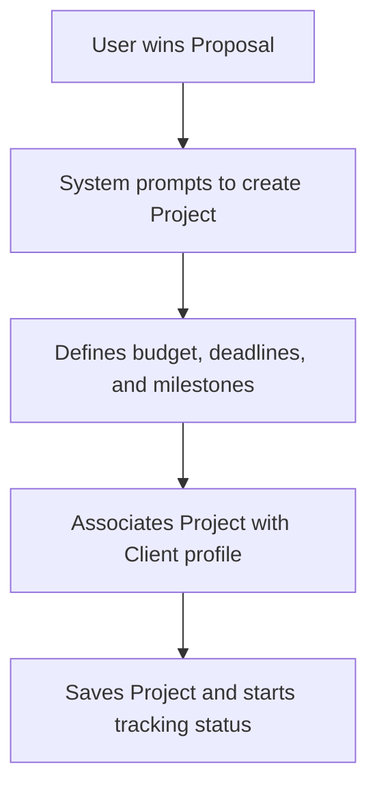

### Inputs
- Project title, budget rules, dates, and client associations.

### Outputs
- Mapped Project document.

### Connected Features
- **Client CRM:** Links project data inside client details tabs.
- **Invoices:** Links completed project milestones to billing lines.

### AI Usage
- **AI Risk Assessor:** Compiles project scope description and timeline data, checking if active milestone dates are realistic and raising alerts if risks are detected.

### Future Improvements
- [ ] Task template configurations for recurring project structures.

---

## 8. Project Details (Workspace)

### Purpose
The collaborative board where freelancers manage day-to-day execution, tasks, files, and project communications.

### User Goals
- Create, assign, and update task cards.
- Upload project files and assets.
- Log comments and reference changes.
- Track time logged on active tasks.

### Main Features
- **Kanban Board:** Drag-and-drop workflow status columns.
- **Asset Manager:** File grid supporting image and PDF attachments.
- **Time Sheet Log:** Timers for recording work sessions.
- **Project Activity Log:** Visual stream of task updates.

### User Workflow
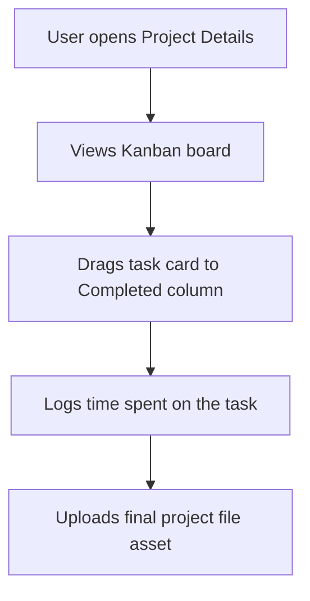

### Inputs
- Task details, comments text, files, and timer triggers.

### Outputs
- Updated task locations and files records.

### Connected Features
- **Invoices:** Allows users to import completed tasks directly into invoicing calculators.

### AI Usage
- AI is not used in this module.

### Future Improvements
- [ ] Auto-transcribe video assets into project task lists.

---

## 9. AI Proposal Generator

### Purpose
Automates the creation of professional proposals using client specifications, past portfolio items, and freelancer profiles.

### User Goals
- Write tailored, high-converting pitches quickly.
- Determine competitive project rates using historical analysis.
- Evaluate the quality of proposals before dispatching.
- Save proposals to history for future template duplication.

### Main Features
- **Opportunity Parser:** Analyzes client requirements and job descriptions.
- **Semantic Matcher:** Identifies relevant portfolio case studies.
- **AI Proposal Builder:** Compiles context into structured Markdown.
- **Proposal Score Evaluator:** Scores proposal strength (0-100) and lists improvements.
- **Markdown Editor:** Native editing panel with PDF export layout styles.

### User Workflow
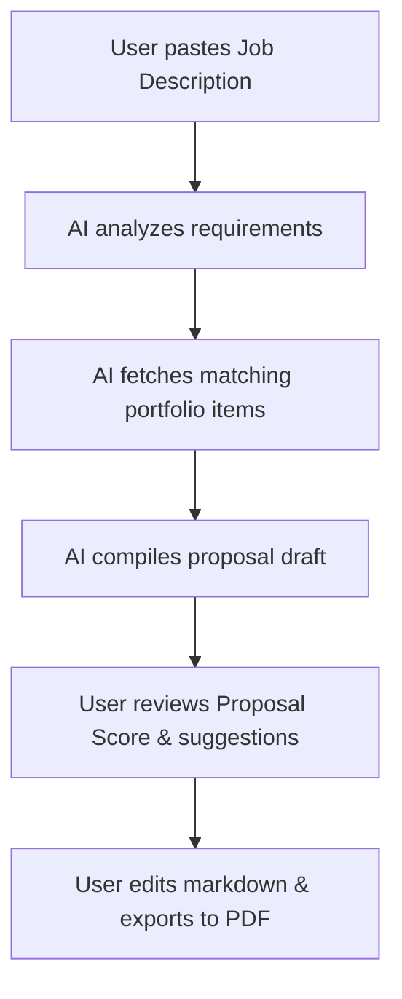

### Inputs
- Job posting text inputs.
- Freelancer profile context and selected portfolio records.

### Outputs
- Tailored Markdown proposal draft.
- Evaluation score report.
- Exported PDF file.

### Connected Features
- **Portfolio Manager:** Feeds case studies into matching engines.
- **Client CRM:** Links generated proposals to client records.

### AI Usage
- **Opportunity Parser & Compiler:** Analyzes job posting text and matches it to relevant portfolio items.
- **Evaluation Engine:** Evaluates the generated proposal against target criteria to output a Proposal Score and optimization list.

### Future Improvements
- [ ] Browser extension allowing users to generate proposals directly on job board platforms.

---

## 10. Invoice System

### Purpose
Simplifies invoicing, coordinates client payment terms, and monitors unpaid revenue pipelines.

### User Goals
- Create and dispatch professional invoices.
- Auto-populate line items from completed project tasks.
- Export invoices as clean PDFs.
- Manage dunning reminders for overdue accounts.

### Main Features
- **Invoice Editor:** Line calculator supporting taxes, discounts, and custom currencies.
- **Invoice Tracker:** Lifecycle states (Draft, Sent, Paid, Overdue).
- **PDF Export Generator:** Renders and downloads professional PDF layouts.
- **Dunning Scheduler:** Configures automatic follow-up reminders.

### User Workflow
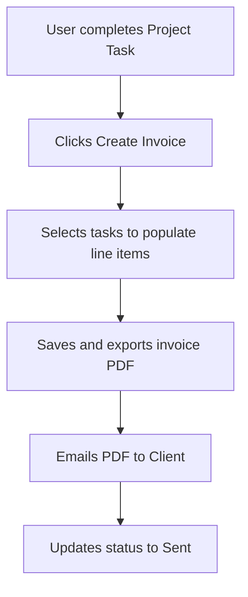

### Inputs
- Client selection, billing items, tax rates, payment deadlines.

### Outputs
- Invoice record.
- Formatted PDF file.

### Connected Features
- **Client CRM:** Logs invoices to client directories.
- **Analytics:** Tracks paid invoices to update MRR graphs.

### AI Usage
- **AI Invoice Assistant:** Analyzes client payment histories to suggest optimal email follow-up schedules.

### Future Improvements
- [ ] Stripe Connect payment rails integration.

---

## 11. Portfolio Manager

### Purpose
Serves as the case study repository for the freelancer’s past work. It supplies the semantic context matched by the AI Proposal Generator.

### User Goals
- Store structured case studies showcasing skills.
- Tag projects with technology and industry tags.
- Upload visual media assets.
- Feature top projects for quick matching.

### Main Features
- **Portfolio Directory:** Visual grid of case studies.
- **Case Study Editor:** Form templates (Problem, Solution, Tech Stack, Results).
- **Tag Library:** Multi-select skill and tool tags.
- **Media uploader:** Handles project screenshot compression (WebP).

### User Workflow
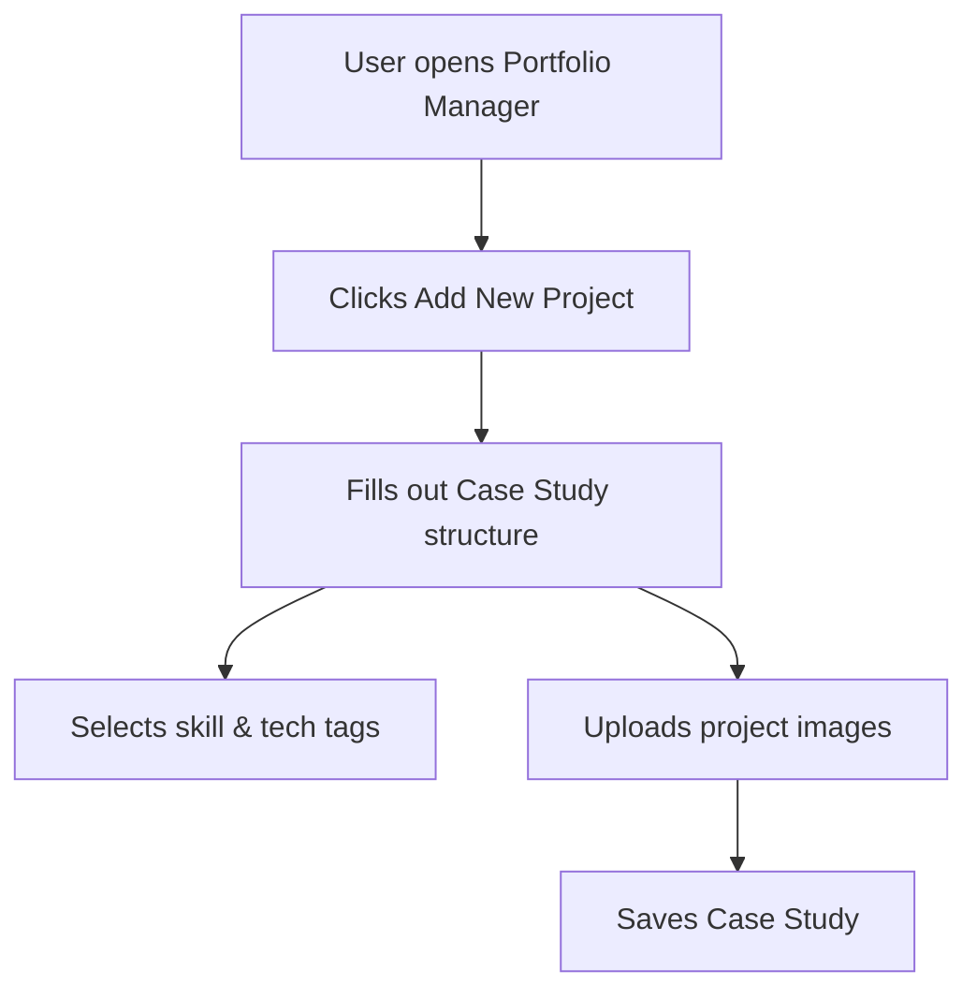

### Inputs
- Project details, tag selections, image assets.

### Outputs
- Case study record.

### Connected Features
- **AI Proposal Generator:** Supplies portfolio contexts to match job postings.
- **Freelancer Profile:** Renders featured items on public profiles.

### AI Usage
- **Semantic Matching Engine:** Scans case studies to match them with job description requirements.

### Future Improvements
- [ ] Auto-import projects from GitHub, Behance, and Dribbble.

---

## 12. Analytics

### Purpose
Aggregates database records to visualize financial performance, proposal success rates, and project efficiency.

### User Goals
- Track Month-over-Month (MoM) revenue growth.
- Review client lifetime values.
- Calculate proposal win ratios.
- Estimate upcoming tax liabilities.

### Main Features
- **Revenue Chart:** Line/Bar graphs showing monthly revenue.
- **Win Ratio Circle:** Pie chart mapping proposal outcomes.
- **DSO Metrics:** Displays average payment speed per client.
- **Tax Liability Widget:** Estimates quarterly tax requirements.

### User Workflow
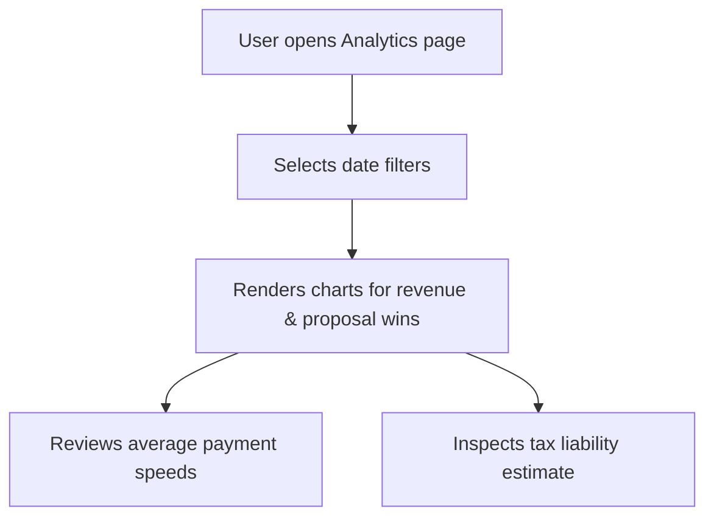

### Inputs
- Date range selections and filter parameters.

### Outputs
- Rendered visual charts and financial KPI calculations.

### Connected Features
- **Invoices / Proposals:** Feeds data to calculation engines.

### AI Usage
- **AI Business Consultant:** Scans analytics data to suggest rate increases or identify client risk clusters.

### Future Improvements
- [ ] Predictive cash flow forecasting models.

---

## 13. Settings

### Purpose
Manages configurations, interface themes, security credentials, and AI model parameters.

### User Goals
- Toggle between Light and Dark interface themes.
- Configure notification preferences.
- Reset passwords and manage accounts security.
- Manage billing subscriptions.

### Main Features
- **Theme Selector:** Toggle settings for system, light, and dark configurations.
- **Notification Toggles:** Email and in-app notifications settings.
- **Account Panel:** Profile edits and password resets.
- **AI Settings Selector:** Configure default temperature and model endpoints.

### User Workflow
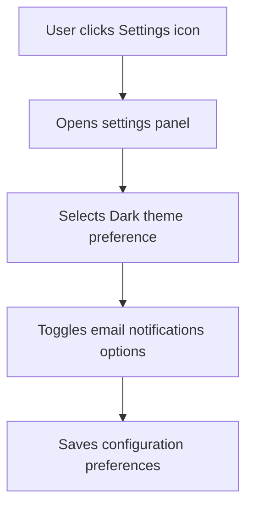

### Inputs
- Setting choices, profile details, password entries.

### Outputs
- Updated settings record.

### Connected Features
- **Authentication:** Password reset logic.
- **Notifications:** Respects notification filters.

### AI Usage
- AI is not used in this module.

### Future Improvements
- [ ] Multi-currency selection preferences.

---

## 14. Notifications

### Purpose
Provides timely updates about project statuses, payment milestones, and AI recommendations.

### User Goals
- Receive instant notifications for important tasks.
- Keep record of notifications history.
- Read messages without losing dashboard context.

### Main Features
- **In-App Alerts Feed:** Dropdown listing recent alerts.
- **Email Dispatcher:** Sends email notifications for critical alerts.
- **Alert Priority Tags:** Categories (Low, Medium, High) for sorting notifications.

### User Workflow
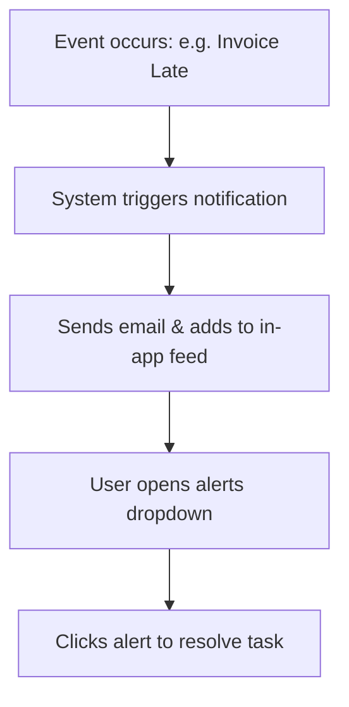

### Inputs
- Event triggers (e.g. system clocks identifying late invoices).

### Outputs
- UI notification cards and email dispatches.

### Connected Features
- **CRM / Projects / Invoices:** Event logs trigger alerts.

### AI Usage
- AI is not used in this module.

### Future Improvements
- [ ] Mobile push notifications via Web Push API.

---

## 15. AI Copilot (Long-Term Vision)

### Purpose
The AI Copilot acts as an autonomous business manager for freelancers, identifying risks and suggesting optimizations.

### User Goals
- Receive proactive advice on rate pricing.
- Receive warnings about client payment delays.
- Get suggestions for improving proposal success.
- Forecast cash flow challenges.

### Main Features
- **Rate Optimizer:** Recommends rate increases based on market demand and current utilization.
- **Timeline Risk Monitor:** Flags projects at risk of missing deadlines.
- **Proactive Reminders:** Prompts users to follow up with clients based on relationship metrics.
- **Revenue Forecaster:** Visualizes future cash flow patterns.

### User Workflow
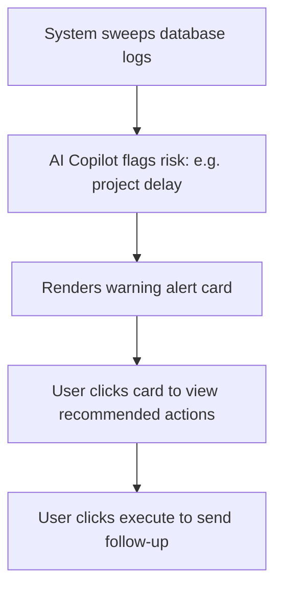

### Inputs
- Database histories (projects, invoices, CRM logs).

### Outputs
- Proactive suggestions cards.
- System email drafts.

### Connected Features
- **Dashboard:** Renders alert cards directly in UI.
- **Invoices / Projects:** Ingests details to evaluate risks.

### AI Usage
- **AI Copilot Core:** Powers all monitoring, analysis, forecasting, and rate recommendation calculations.

### Future Improvements
- [ ] AI-driven voice interface for conversational business reporting.

---

## Feature Relationships

The diagram below illustrates how data and workflows transition across modules, showing how FreelAI acts as a cohesive workspace.

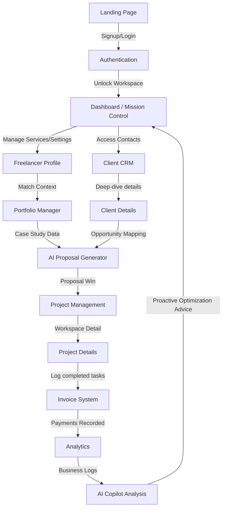

---

## Planned Features

- **Contracts Suite:** Automated generation and secure e-signing of project contracts.
- **Email Integration:** Send and receive client emails directly inside the CRM.
- **Calendar Scheduler:** Schedule calls and meetings using an integrated scheduler (e.g. Cal.com style).
- **Stripe Connect Payment Rails:** Process client credit cards and bank transfers natively.
- **Browser Extension:** Generate proposals directly inside job boards (Upwork, LinkedIn).
- **Autonomous AI Agents:** Autonomous task executors to handle client inquiries.
- **Team Collaboration:** Multi-seat support for creative agencies.
- **Mobile Application:** Dedicated iOS and Android layouts.
- **Internal Knowledge Base:** A searchable wiki for storing custom developer instructions.
