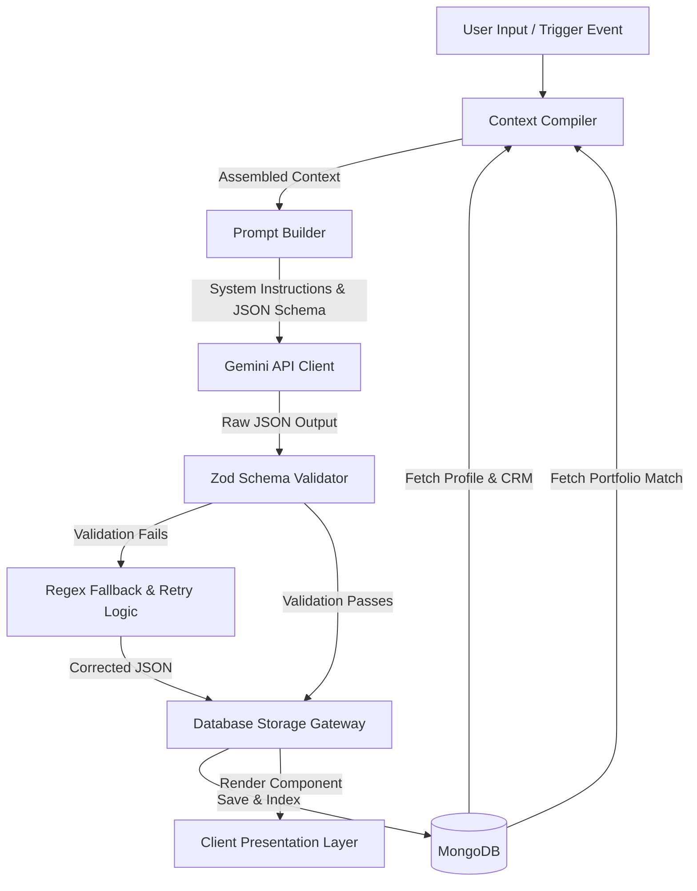
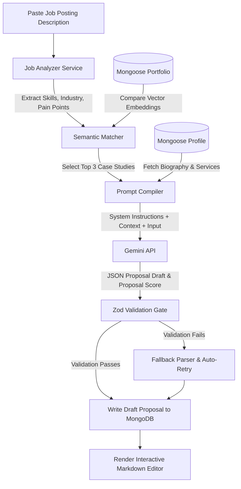
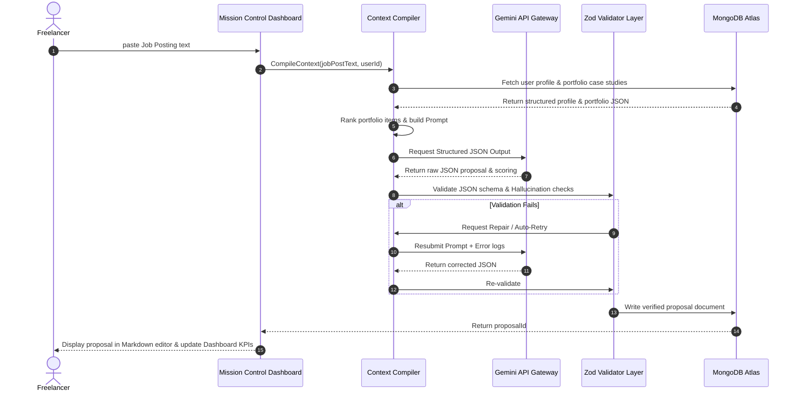

# AI System & Workflows

**Current Status:** Approved  
**Last Updated:** 2026-07-09  
**Related Documents:** [Technical Stack & Architecture](02-tech-stack.md), [AI Prompt Library](09-prompts.md), [Features Specification](05-features.md)

---

## 1. AI Overview

FreelAI is designed as an **AI-native application**. Rather than treating artificial intelligence as a superficial wrapper or a generic chatbot widget, FreelAI embeds AI throughout its data models and business workflows. 

### Platform-Wide AI Integration
- **Proposal Generation:** Matches opportunities with past portfolio case studies and profile skills.
- **Client Intelligence:** Analyzes payment cycles and interaction patterns to calculate account health.
- **Project Risk Detection:** Scans task completion velocities to warn users of deadline risks.
- **Invoice & Pricing Suggestions:** Recommends optimal billing terms and rates based on historical utilization.
- **Proactive Growth Recommendations:** Identifies opportunities for rate increases and skill expansion.

### Overall AI Philosophy
The core philosophy is **assistive automation**. The AI operates as a background partner, compiling data and suggesting drafts, but leaving final validation, execution, and dispatch control in the hands of the freelancer.

---

## 2. AI Principles

All AI features and services within FreelAI must adhere to the following principles:

1. **AI Assists, Never Replaces:** The system drafts proposals, invoices, and emails, but never dispatches them without user review and confirmation.
2. **Context-Aware over Generic:** Prompt compilers must fetch specific profile details, portfolios, and CRM data to customize responses, eliminating generic templates.
3. **Strict Zero-Hallucination Gate:** The validation layer blocks any AI outputs that claim project histories or credentials not present in the database.
4. **Transparency & Explainability:** Whenever the AI makes a recommendation (e.g. suggesting a rate increase), it must list the data points supporting that conclusion.
5. **Proactive over Reactive:** The AI does not wait for a chat command. It runs background analysis on database changes to populate the dashboard with immediate suggestions.

---

## 3. AI Architecture

FreelAI's AI engine separates raw user input from prompt assembly and model execution, ensuring data validation occurs at every stage of the lifecycle.



### Architectural Stages
1. **Context Compiler:** Fetches relevant records (Profile, CRM, Portfolio, Invoices) matching the session's `userId`.
2. **Prompt Builder:** Combines system instructions, user context blocks, and target JSON formats into secure prompt strings.
3. **Inference (Gemini Client):** Submits prompts to Gemini Flash using structured schema outputs.
4. **Validation (Zod Gateway):** Checks the returned JSON against typescript schemas to guarantee formatting and data integrity.
5. **Fallback & Persistence:** Handles parsing errors automatically before writing secure records to MongoDB.

---

## 4. AI Context System

The quality of LLM outputs depends on the depth and specificity of the context provided. FreelAI compiles a dynamic context block for every AI transaction.

### Context Components
- **Freelancer Profile:** Skills tags, years of experience, standard rates, standard service descriptions, languages, and tone-of-voice preferences.
- **Portfolio Case Studies:** Problem descriptions, solutions delivered, technology lists, and project results from past works.
- **Client CRM Profiles:** Industry details, billing history, communication logs, and relationship health records.
- **Project Tracking Boards:** Active milestone timelines, task progress meters, and logged hours.
- **Invoicing Ledgers:** Payment velocities (DSO), overdue invoice timelines, and billing history.
- **User Settings:** AI configuration variables (e.g., target models, default temperatures).

Injecting this structured database context directly into the prompt ensures that the generated text matches the user's brand, targets the client's industry, and references actual historical work.

---

## 5. Proposal Generation Pipeline

The proposal generation pipeline matches client requirements against the freelancer's historical portfolio case studies.



---

## 6. Job Analyzer

The Job Analyzer is the first stage of the proposal pipeline. It parses raw, unformatted job postings to extract structural constraints.

### Extracted Attributes
- **Detected Skills:** Specific technical tools, methodologies, or capabilities required (e.g., "Next.js", "Motion Graphics").
- **Deliverables list:** The exact assets the client wants delivered (e.g., "Landing page design", "1-minute promotional video").
- **Estimated Budget & Timeline:** Identifies budget expectations or timeline requirements mentioned in the text.
- **Complexity & Urgency:** Scores the project complexity and urgency to tailor the tone of the proposal.

These parameters are mapped to TypeScript interfaces, allowing the matching engine to find the closest portfolio matches.

---

## 7. Portfolio Matching

The portfolio matching system determines which case studies are relevant to the analyzed opportunity.

### Matching & Filtering Logic
- **Semantic Similarity:** Compares embeddings of the job description with the case studies to find projects with similar problem-solution contexts.
- **Skill Overlap Score:** Ranks projects based on how many skills they share with the opportunity.
- **Relevance Gate:** Filter out case studies that fall below a minimum relevance threshold. This prevents the AI from referencing irrelevant work (e.g., generating a Node.js proposal that references a video editing case study), which causes hallucinations and dilutes the pitch.

---

## 8. Freelancer Profile Context

The Freelancer Profile acts as the **central repository of truth** for personalization.

```
+-----------------------------------------------------------+
|                   Freelancer Profile                      |
|                                                           |
|  - Skill Tags: [TypeScript, Next.js, TailWind]            |
|  - Tone: Professional, direct, technical                  |
|  - Standard Rate: $85/hour                                |
|  - Standard Service: Full-stack Development               |
+-----------------------------------------------------------+
                              |
                              v
+-----------------------------------------------------------+
|                     AI Prompt Builder                     |
|                                                           |
| "You are [Name]. Write a proposal. Use the standard rate   |
| of $85/hr. Write in a professional, direct, technical     |
| tone. Highlight experiences in TypeScript, Next.js..."    |
+-----------------------------------------------------------+
```

By referencing the profile, the generated proposal writes in the user's tone, matches their rates, and represents their capabilities accurately.

---

## 9. Prompt Construction

Prompts are constructed dynamically on the server. They are structured systematically to prevent instructions overrides and guarantee schema compliance.

### Prompt Segments
1. **System Instructions:** Establishes the persona (e.g., "You are an expert software engineer..."), details parsing tasks, and defines the structural output schema.
2. **User Context Block:** Injects database profile summaries, matching portfolio pieces, and client CRM records inside isolated XML/JSON tags.
3. **Operational Input:** The target job description or invoice parameters.
4. **Behavioral Constraints:** Explicit rules (e.g., "Do not mention technologies not listed in the portfolio context. Do not make up past client names").
5. **JSON Schema Specification:** Details the exact JSON output format expected by the parser.

---

## 10. AI Validation

Raw LLM responses are processed through a multi-tier validation system before saving to the database.

```
       +---------------------------------------------+
       |             Raw Gemini JSON Output          |
       +---------------------------------------------+
                              |
                              v
       +---------------------------------------------+
       |           Tier 1: Zod Schema Parse          |
       +---------------------------------------------+
        /                                           \
    (Pass)                                        (Fail)
      /                                               \
     v                                                 v
+----------+                                  +-------------------+
| Tier 2   |                                  | Regex Fallback &  |
| Content  |                                  | Auto-Correction   |
| Validator|                                  +-------------------+
+----------+                                           |
                                                       v
                                              +-------------------+
                                              | Re-submit / Retry |
                                              +-------------------+
```

### Validation Gates
- **Zod Schema Parsing:** Verifies that returned keys, types, and array dimensions match TypeScript interfaces.
- **Hallucination Checking:** Cross-checks references to portfolio case studies in the proposal text with the actual case studies. If the text references a project not provided in the context, the validation gate rejects the draft.
- **Tech Stack Check:** Ensures that the proposal does not claim experience in technologies not listed in the freelancer's profile.
- **Fallback & Repair:** If the JSON is malformed, regex parsers attempt to extract parameters. If unsuccessful, the system automatically resubmits the request to the LLM with the error logs.

---

## 11. AI Copilot

The AI Copilot operates as a proactive background service rather than a reactive chatbot.

### Proactive Operations
- **Daily Briefing:** Dynamically compiles active tasks, overdue invoices, and meeting schedules into a personalized daily overview.
- **Timeline Risk Detection:** Monitors task completions against milestone dates and warns the user if a project is likely to slip.
- **Invoice Follow-up Suggestions:** Triggers follow-up draft recommendations when an invoice passes its due date.
- **Rate Optimization Advice:** Analyzes utilization rates and proposal success rates to suggest rate increases.

---

## 12. Future AI Agents

In future releases, the platform will support autonomous AI Agents.

| Agent Name | Primary Responsibility | Input Triggers | Actions Taken |
|:---|:---|:---|:---|
| **Proposal Agent** | Monitors job boards and compiles draft proposals automatically. | New Upwork/LinkedIn RSS posting. | Saves draft proposal, notifies user via dashboard. |
| **CRM Agent** | Tracks client interactions and drafts follow-up emails. | 14 days of communication silence detected. | Drafts relationship-check email template. |
| **Finance Agent** | Forecasts tax liabilities and analyzes cash flow. | Invoice paid event. | Updates cash flow forecasts, calculates tax reserves. |
| **Growth Agent** | Recommends rate adjustments and skill paths. | Proposal success analytics check. | Recommends skill paths and rate increases. |

---

## 13. Security

AI security designs prioritize data integrity and prevent cross-tenant leaks.

- **Tenant Context Isolation:** The database connector gates all queries using the session’s verified `userId`. Under no circumstances can data from other accounts be injected into an LLM context.
- **Prompt Injection Defense:** External inputs (like job postings) are treated as unverified text and are wrapped inside structural JSON fields in instructions, preventing prompt injection overrides.
- **API Key Isolation:** Gemini API keys are loaded via server-side environment variables and are never exposed to client-side browsers.
- **Data Privacy:** FreelAI does not use user data, proposals, or portfolio case studies for public model training. All data remains private.

---

## 14. Limitations

Understanding current boundaries ensures realistic expectations for system performance.

- **Model Latency:** Structured outputs and detailed prompt analysis can take 2-4 seconds to generate.
- **Context Window Constraints:** Very large portfolios or CRM histories must be ranked and truncated before prompt injection to avoid token limit errors.
- **Parsing Inaccuracies:** Highly unstructured job descriptions can occasionally cause parsing errors in the Job Analyzer.

---

## 15. Future AI Roadmap

The AI systems will continue to evolve through planned features:

- **Vector Database RAG Integration:** Migrate semantic search queries to a dedicated vector database (e.g. MongoDB Atlas Vector Search) for faster matching.
- **Voice Assistant:** Synthesize natural-language summaries of dashboard analytics and let users dictate comments.
- **Browser Overlay Extension:** A browser extension that lets users generate proposals directly on external platforms.
- **Meeting Summarization:** Transcribe video calls and automatically update CRM boards.

---

## AI Workflow Lifecycle

The diagram below shows the complete lifecycle of an AI operation inside FreelAI, from user input to dashboard presentation.


