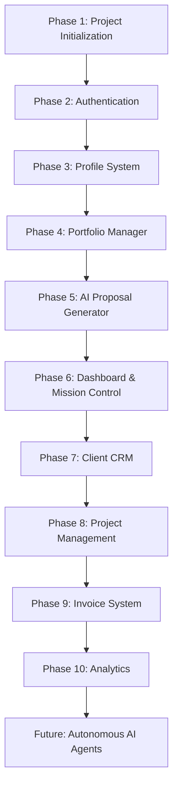

# Product Roadmap & Knowledge Base

**Current Status:** Approved  
**Last Updated:** 2026-07-09  
**Related Documents:** [Product Overview](01-overview.md), [Features Specification](05-features.md), [AI System & Workflows](06-ai-system.md)

---

## 1. Product Roadmap

The diagram below outlines the sequential development phases of the FreelAI platform, showing the path from initialization to autonomous AI agents:



---

## 2. Completed Features

This registry details the features whose visual and database specifications have been finalized in Phase 0-7:

| Feature Module | Purpose | Completion Status | Notes | Future Improvements |
|:---|:---|:---|:---|:---|
| **Landing Page** | Marketing gateway & FAQs. | Specification Complete | Layout, pricing matrix, and FAQ structure finalized. | Add live sandbox prompt demo. |
| **Authentication** | Access control & sessions. | Specification Complete | Mapped credentials, OAuth, and page-guard middleware. | Multi-Factor Authentication. |
| **Dashboard** | Mission Control overview. | Specification Complete | KPI cards, activity log widgets, and briefing panels. | Collapsible / resizable widgets. |
| **Freelancer Profile** | Professional source of truth. | Specification Complete | Skill directories, services hourly rates, and AI tones. | Profile optimization auditor. |
| **Client CRM** | Relationship management. | Specification Complete | Client profiles, contact channels, and health metrics. | Automatic email logging logs. |
| **Project Management** | Task tracking & Kanban boards. | Specification Complete | Milestone lines, budget meters, and task board grids. | Task template automation. |
| **AI Proposal Generator** | High-conversion pitching. | Specification Complete | Opportunity parsers, semantic matches, and scores. | Job boards integrations. |
| **Invoice System** | Professional billing & reminders. | Specification Complete | Line calculators, PDF generators, and dunning logs. | Stripe Connect integration. |
| **Portfolio Manager** | Context library for AI matching. | Specification Complete | Case studies forms, skill tags, and WebP media. | GitHub/Behance auto-imports. |
| **Analytics** | Revenue & conversion visuals. | Specification Complete | Recharts graphs, MRR metrics, and tax calculators. | Cash flow predictive forecasting. |
| **Settings** | Configuration controls. | Specification Complete | Theme switches, credentials, and model parameter sliders. | Multi-currency defaults. |
| **Notifications** | Alerts feed & email dispatcher. | Specification Complete | In-app alerts, email dispatches, and trigger matrices. | Mobile push web integrations. |
| **AI Copilot** | Proactive assistant card. | Specification Complete | Dashboard briefings and at-risk project alerts. | Voice interface summarizers. |

---

## 3. Features In Progress

### Active Work Task
- **Phase 0 Documentation Foundation:** Compiling the complete documentation system to serve as the single source of truth for the project.
- **Expected Completion:** 2026-07-09 (Current Phase completion).
- **Dependencies:** None.

---

## 4. Planned Features

Future extensions planned for development in subsequent releases:

- **Contracts Suite:** Automated creation and electronic signature of freelance consulting agreements.
- **Calendar Scheduler:** Built-in scheduler for booking client calls natively (similar to Cal.com).
- **Email Integration:** Complete sync enabling freelancers to send and read client emails inside the CRM.
- **Stripe Connect Integration:** Natively process credit card payments and coordinate bank payouts.
- **Browser Extension:** Overlay extension for instant proposal compilation directly on platforms like Upwork and LinkedIn.
- **Workflow Builder:** Customizable workflow automation engine (e.g. automatically send invoice when project changes status to "Done").

---

## 5. Long-Term Vision

FreelAI is designed to transition from a reactive proposal writing tool into an autonomous AI Business Operating System (BOS) for freelancers.

### 6 Months
- Establish core database models, user registries, and the AI Proposal Generator.
- Release stable PDF invoice generation and Stripe billing integrations.
- Roll out semantic portfolio matching.

### 1 Year
- Build deep CRM calendar and email syncs, compiling all client interactions.
- Launch the AI Copilot briefing panel as a proactive, autonomous risk monitoring engine.
- Integrate contract generation and legal signature workflows.

### 2 Years
- Launch autonomous background agents that automatically scan incoming job opportunities, check resource schedules, draft initial pitches, and schedule billing follow-ups.
- Expand platform to support small collaborative agency settings with shared workspaces.

---

## 6. Technical Debt Tracker

We monitor these known development trade-offs to keep the codebase maintainable:

- **Monolithic Page Layouts:** Keep App Router layout files lightweight. Relocate heavy layout trees to modular components inside `features/`.
- **Validation Consistency:** Ensure Zod schemas are shared between frontend React Hook Forms and backend API route handlers to avoid duplicate validation code.
- **Database Query Truncation:** Implement query selectivity in Mongoose calls to prevent fetching large media records during simple listings lookups.
- **Test Coverage Gaps:** Ensure unit tests cover the core AI prompt compiler logic to prevent regression breaks.

---

## 7. Release Notes Template

When deploying new versions, release notes must be logged using the following structure:

```markdown
### Version [X.Y.Z] - YYYY-MM-DD
- **Major Changes:** High-level list of new features and capabilities.
- **Breaking Changes:** Explicit list of API or schema modifications that break older versions.
- **Migration Notes:** Step-by-step instructions for database migrations or configuration variable updates.
```

---

## 8. Lessons Learned

Important engineering guidelines distilled from Phase 0-7 architecture evaluations:

- **Strict Schema Validation:** Never trust LLM returns. Always wrap AI outputs in Zod validators before database writes.
- **Context Boundaries:** When writing prompts, segregate unverified user text (such as job postings) within structured JSON keys to protect against prompt injection instructions.
- **Atomic Database Operations:** Utilize MongoDB atomic updates (`$set`, `$inc`) to prevent race conditions during concurrent user operations.
- **Accessibility Integration:** Design accessible HTML structures from day one; retrofitting ARIA tags and tab focus lines into complex components is highly error-prone.

---

## 9. Future AI Vision

The long-term AI architecture is designed to support specialized background workers:

- **Proposal Agent:** Autonomously monitors RSS job boards, screens opportunities for "Portfolio Match" scores, and notifies the user of top prospects.
- **CRM Agent:** Evaluates client interaction frequencies and payments logs to suggest relationship-building check-ins.
- **Finance Agent:** Conducts monthly tax projections, revenue analyses, and predictive cash flow forecasts.
- **Calendar & Email Agent:** Autonomously schedules calls and drafts initial responses to client inquiries.
- **Growth Agent:** Scans utilization rates and proposal win metrics to suggest optimal pricing updates.
