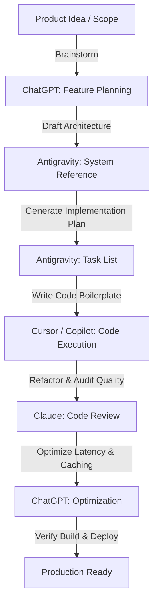

# AI Prompt Library & Collaboration Guide

**Current Status:** Approved  
**Last Updated:** 2026-07-09  
**Related Documents:** [Product Overview](01-overview.md), [Technical Stack & Architecture](02-tech-stack.md), [AI System & Workflows](06-ai-system.md)

---

## 1. Purpose

This document serves as the central prompt repository and AI collaboration guide for the FreelAI project. It provides standardized prompt templates for various coding assistants, outlines prompt engineering guidelines, and details context-sharing best practices to ensure that AI-generated code remains consistent with FreelAI's design and architecture principles.

---

## 2. Prompt Categories

### Antigravity (Architect & System Agent)
Use Antigravity to analyze system architecture, compile documentation, and write implementation plans.

- **Architecture Refinement:**
  ```markdown
  Analyze the current system structure inside [02-tech-stack.md](02-tech-stack.md). Recommend improvements to separate database access logic from API route controllers, ensuring strict compliance with our service-layer pattern.
  ```
- **Documentation Updates:**
  ```markdown
  Update [04-database.md](04-database.md) to add a new schema description for the 'Contracts' collection. Ensure it follows our metadata headers and references the appropriate index strategies.
  ```
- **Implementation Planning:**
  ```markdown
  Create an implementation plan for adding Google OAuth provider support in Next.js App Router using Auth.js (v5). Follow the format specified in our planning instructions, linking relevant technical guides.
  ```

---

### Stitch (Frontend UI Agent)
Use Stitch to wireframe layouts, configure Recharts graphs, and refine responsive visual components.

- **Dashboard Charts config:**
  ```markdown
  Design a responsive bar chart component using Recharts to visualize Monthly Recurring Revenue (MRR). Ensure gridlines are horizontal only, and map the tooltip borders and typography to match [07-design-system.md](07-design-system.md).
  ```
- **Invoices Details layout:**
  ```markdown
  Create a slide-out Drawer component for the invoice creation form. The drawer must adjust layout from desktop to mobile screens, trap keyboard focus when open, and utilize input validation tags.
  ```

---

### ChatGPT (Product Planning & Learning Agent)
Use ChatGPT to brainstorm feature workflows, research third-party SDKs, and debug conceptual errors.

- **Feature Workflows Brainstorming:**
  ```markdown
  Outline a step-by-step user interaction flow for an automated PDF invoice payment reminder. What status flags should trigger notifications, and what dunning rules should govern follow-up emails?
  ```
- **Conceptual Error Debugging:**
  ```markdown
  Explain how to cache database connection states inside a Next.js serverless route handler to prevent MongoDB connection pool starvation under high concurrent traffic.
  ```

---

### Claude (Review & Refactoring Agent)
Use Claude to review code quality, analyze prompt templates, and refactor heavy modules.

- **Code Review:**
  ```markdown
  Review this TypeScript route handler for potential security vulnerabilities. Specifically, check if tenant isolation is enforced by gating queries with userId, and verify that Zod schema validations strip out malformed parameters.
  ```
- **Prompt Engineering Audit:**
  ```markdown
  Audit the prompt template inside our proposal compiler service. Reorganize the instructions to prevent prompt injection overrides and ensure the model strictly yields the requested Zod schema shape.
  ```

---

### Cursor / Copilot (Inline Code Generator)
Use Cursor or Copilot to generate boilerplate structures, write TypeScript interfaces, and construct unit tests.

- **Interface Generation:**
  ```markdown
  Create a TypeScript interface for the Client database document matching the Mongoose model schema in [04-database.md](04-database.md). Ensure all fields have clear comments.
  ```
- **Unit Test Template:**
  ```markdown
  Write a Jest unit test suite for the date format utility function. Test edge cases including invalid date strings, leap years, and timezone conversions.
  ```

---

## 3. Prompt Writing Guidelines

To get high-quality, bug-free outputs from coding assistants, follow these guidelines when writing prompts:

- **Always Provide Context:** Specify the files and tech stacks involved. Never ask for code changes in a vacuum.
- **Set Explicit Constraints:** Outline what the AI must *not* do (e.g. "Do not introduce external libraries. Do not duplicate existing layout styles").
- **Specify the Output Format:** Request specific formats (e.g. "Return only the refactored React component. Do not include introductory text").
- **Avoid Ambiguity:** Use exact file names and directory paths instead of writing general pronouns like "it" or "the controller".

### Examples
- **Poor Prompt:** *“Write an API route to save client details.”* (Ambiguous, no context, no validation rules).
- **Good Prompt:** *“Write a Next.js App Router API Route Handler at `src/app/api/clients/route.ts` to handle POST requests for saving new client documents. The payload must be validated using Zod matching the Client schema in [04-database.md](04-database.md). The handler must verify Auth.js credentials, filter writes by the session's userId, and return a standardized JSON error/success payload.”*

---

## 4. AI Collaboration Workflow

The diagram below outlines the recommended pipeline for collaborating with various AI assistants when building features in FreelAI:



### Collaboration Pipeline Steps
1. **Brainstorming:** Use ChatGPT to define user flows and boundary requirements.
2. **System Design:** Use Antigravity to write implementation plans and verify database schemas.
3. **Execution:** Use Cursor or Copilot to generate boilerplate code and TypeScript interfaces.
4. **Code Quality:** Use Claude to audit security lines and verify contrast accessibility rules.

---

## 5. Context Sharing Guide

When initiating a conversation with an AI assistant about a specific module, upload only the relevant documentation files to prevent context window bloat and keep the assistant focused:

- **If working on AI Proposal Generator:**
  - Ingest: [05-features.md](05-features.md), [06-ai-system.md](06-ai-system.md), [04-database.md](04-database.md).
- **If working on Dashboard widgets or Styling:**
  - Ingest: [05-features.md](05-features.md), [07-design-system.md](07-design-system.md), [02-tech-stack.md](02-tech-stack.md).
- **If working on Database collections or migrations:**
  - Ingest: [04-database.md](04-database.md), [02-tech-stack.md](02-tech-stack.md).

---

## 6. Best Practices

- **Reference Documentation:** When prompting an AI, paste or link the relevant section of our documentation (e.g. `Use button styles as specified in [07-design-system.md](07-design-system.md)`).
- **Keep Code Consistent:** Do not let the AI invent new naming conventions, CSS styles, or directories. Enforce the folder structure outlined in [10-development-guide.md](10-development-guide.md).
- **Reject Monolithic Refactors:** If an assistant suggests rewriting a whole system from scratch, reject the change. Ask it to focus on discrete, testable components.
