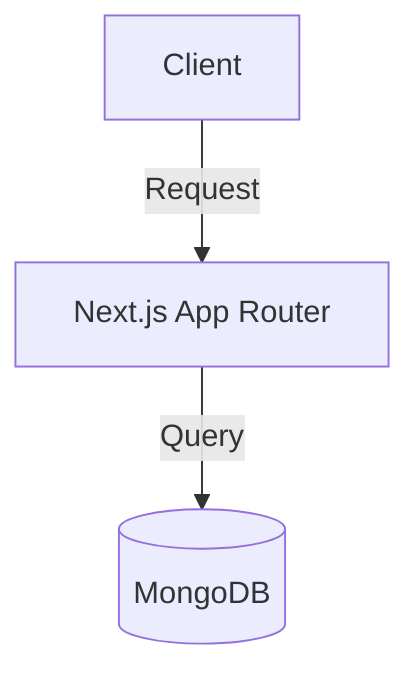

# Documentation Standards

This document establishes the standards, style guidelines, and formatting rules for all FreelAI documentation. Adhering to these standards ensures consistency, high readability, and compatibility with AI coding assistants.

---

## 1. Document Structure & Heading Hierarchy
Every documentation page must start with a single H1 (`#`) heading representing the document title. Do not use multiple H1 headings on a single page.

- **H1 (`#`)**: Main Title (one per page).
- **H2 (`##`)**: Major Sections (e.g., Overview, Architecture, References).
- **H3 (`###`)**: Sub-sections under major sections.
- **H4 (`####`)**: Specific file lists, APIs, or low-level components.

### Hierarchy Example
```markdown
# Document Title

## Overview
Brief introduction.

## Proposed System
Detail explanation.

### Component Details
Sub-component info.
```

---

## 2. Formatting & Writing Style

### Writing Style Guidelines
- **Clear & Concise:** Write short paragraphs (3-4 sentences max). Avoid verbose prose.
- **AI-Assistant Friendly:**
  - Avoid ambiguous terminology. Specify names instead of writing pronouns ("the system," "it," "this").
  - Do not use relative references like *"As mentioned elsewhere"* or *"See the previous page."* Instead, explicitly reference and link the page: *"As defined in [02-tech-stack.md](02-tech-stack.md)..."*.
  - Keep pages self-contained. Repeat small amounts of critical context where necessary to allow AI tools to process individual files efficiently.
- **Tone:** Professional, direct, and developer-oriented.

### Markdown Elements

#### Lists
- Use hyphens (`-`) for unordered lists.
- Use numbers (`1.`, `2.`) for ordered lists/flows.
- Ensure a blank line before and after a list to preserve correct HTML rendering.

#### Tables
- Use tables for configurations, schemas, API endpoints, and comparisons.
- Align columns appropriately.

Example:
```markdown
| Parameter | Type | Required | Description |
|:----------|:----:|:--------:|:------------|
| `userId`  | String | Yes | Unique ID of the authenticated user. |
```

#### Code Blocks
- Always specify the language name for syntax highlighting (e.g., `typescript`, `tsx`, `bash`, `json`, `yaml`).
- Use `typescript` or `javascript` instead of general `js`/`ts`.

Example:
```typescript
const key = "value";
```

#### Callouts (Admonitions)
Use MkDocs-compatible markdown format for alerts and admonitions.

```markdown
!!! note
    This is a standard informative note callout.

!!! warning
    This is a warning alert highlighting critical behavior.
```

---

## 3. Visual Assets & Diagrams

### Images
- Reference images using standard markdown syntax: ``
- Ensure image paths are relative to the file.
- All screenshots must be stored in `docs/assets/images/` and compressed to WebP format.

### Mermaid Diagrams
- Prefer Mermaid diagrams over static images for system architecture, flows, and state transitions.
- Wrap Mermaid code inside a `mermaid` code block.

Example:
```markdown

```

---

## 4. Naming Conventions & Cross-Linking

### File Naming
- All documentation filenames must be lowercase, starting with a sequence number for core files (e.g., `01-overview.md`), or kebab-case for specific items (e.g., `documentation-standards.md`).
- Avoid spaces or special characters in filenames.

### Cross-Linking
- Use relative paths for links between documents (e.g., `[Overview](01-overview.md)`).
- Ensure links are exact and do not lead to 404 pages. Do not hide links behind backticks.
  - **Correct:** `[Tech Stack & Architecture](02-tech-stack.md)`
  - **Incorrect:** `[\`Tech Stack & Architecture\`](02-tech-stack.md)`

---

## 5. Document Maintenance & Versioning

### Document Update Rules
When adding or updating content (e.g., adding a new feature):
1. **No Restructuring:** Integrate the information into existing documents. For instance:
   - New feature? Create a new file or update the index in the [features/](features/README.md) directory.
   - New AI workflow? Append a section in [05-ai-system.md](05-ai-system.md).
2. **Current Status Section:** Every page must include a "Current Status" block to easily track what is fully implemented versus planned.

### Document Header Block
Every document must start with the following standard metadata block:

```markdown
# [Title]

**Current Status:** [Draft / Under Review / Approved]  
**Last Updated:** YYYY-MM-DD  
**Related Documents:** [Doc Name](relative-path.md)
```
